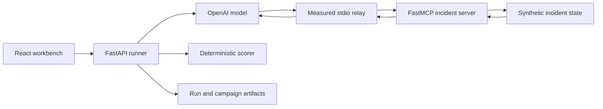

# MCP Traffic Analysis

A statistical performance study of MCP-based AI agents.

## What does this repository study?

The repository measures how a real AI agent communicates and behaves while resolving controlled, synthetic IT incidents.

The agent receives an incident ticket, investigates through local MCP tools, attempts a simulated remediation, and returns a structured answer. The system records:

- model and MCP call counts;
- exact local stdio request and response frame bytes;
- model, MCP, handler, orchestration, and total latency;
- tokens and estimated model cost;
- ordered tool traces and rejected actions; and
- objective task success against known ground truth.

No real infrastructure is changed. The incident world is an isolated JSON state machine.

## Active studies

### Phase 3: measured incident agent

Phase 3 asks what one complete model-driven agent trace looks like. It provides three incident families:

| Incident | Hidden cause | Required action |
|---|---|---|
| Checkout failures | defective deployment | roll back the identified deployment |
| Image-worker degradation | memory saturation on one worker | restart the affected worker |
| Orders API outage | identity-service dependency outage | escalate to the recorded owner |

The corrected 30-run pilot succeeded 30/30 times. Its action ledger still exposed inefficient behavior: every orders run attempted an invalid restart before escalating correctly.

### Phase 4: task-structure experiment

Phase 4 asks whether hidden task structure changes agent workload and reliability. Each incident appears as a sequential, branching, or recovery task while the visible ticket, model, tools, prompt policy, and transport remain fixed.

The completed main campaign contains

$$
3\ \text{incidents}\times3\ \text{structures}\times10\ \text{repetitions}=90\ \text{runs}.
$$

Recovery structure increased expected MCP calls by about 20.5% relative to sequential structure. Branching showed no detectable call-count difference. Overall success was 85/90; all five failures occurred in the orders recovery condition.

Read [the single Phase 4 results document](docs/results/phase4_task_structure_results.md) for the model, covariates, uncertainty, trace variability, limitations, and artifact checksums.

### Phase 5: stochastic trace and failure-path study

Phase 5 asks a practical question about the Orders recovery condition:

> After escalation is rejected, does the agent read the runbook before trying another action, and how is that observable choice associated with failure?

The credit-free Stage 5A reanalysis uses the 90 saved Phase 4 runs. In its ten focused Orders-recovery observations, the five agents that read the runbook first succeeded and the five that retried first failed. The separate Stage 5B campaign is now complete with 100 valid runs; 17 earlier provider-error attempts remain visible for audit but are excluded from the scientific analysis.

Phase 5 also reports complete path frequencies, entropy, one-step transition counts, oracle divergence, and excess calls. It does not infer private model reasoning or claim that the traces form a Markov chain. See [the Phase 5 study guide](docs/phase5_stochastic_traces.md) and [single Phase 5 result document](docs/results/phase5_stochastic_trace_results.md).

## What crosses the measurement boundary?



The relay records newline-delimited MCP/JSON-RPC frames and forwards the same bytes unchanged. These are application-layer frames—not HTTP, TLS, TCP, or IP packets.

For run $r$, the main recorded quantities include

$$
N_{\mathrm{model},r},\quad
N_{\mathrm{MCP},r},\quad
L_{\mathrm{total},r},\quad
L_{\mathrm{model},r},\quad
L_{\mathrm{MCP},r},\quad
B_{\mathrm{request},r},\quad
B_{\mathrm{response},r},\quad
C_r,\quad
Y_r.
$$

Server-handler time is nested inside MCP time and is reported separately rather than added twice.

## Run the workbench

Requirements:

- Python 3.13;
- Node.js and npm;
- `uv`; and
- an ignored `.env` containing `OPENAI_API_KEY` for live model runs.

Install and start:

```powershell
uv --cache-dir .uv-cache python install 3.13
uv --cache-dir .uv-cache sync --locked --all-groups
npm install
npm run demo
```

Open `http://127.0.0.1:8000`.

The UI has three active surfaces:

- **Trace dynamics** — connect the rejected-action story to counts, probabilities, uncertainty, paths, and efficiency;
- **Behavior study** — compare sequential, branching, and recovery tasks;
- **Incident Agent** — run and inspect one measured agent trace.

Scripted validation spends no model credit. Live mode uses the hosted model and measured stdio transport. Repeated paid campaigns remain CLI-only.

## Run the campaigns

Phase 3:

```powershell
uv --cache-dir .uv-cache run --all-groups python -m mcp_traffic_analysis.agent_campaigns incident-pilot-v2
```

Phase 4 credit-free design validation:

```powershell
uv --cache-dir .uv-cache run --all-groups python -m mcp_traffic_analysis.behavior.campaigns task-structure-pilot-check --stage pilot --mode deterministic
```

Phase 4 live pilot or main campaign:

```powershell
uv --cache-dir .uv-cache run --all-groups python -m mcp_traffic_analysis.behavior.campaigns task-structure-pilot-v2 --stage pilot
uv --cache-dir .uv-cache run --all-groups python -m mcp_traffic_analysis.behavior.campaigns task-structure-main-v1 --stage main
```

Use `--resume` after interruption or `--analyze-only` to rebuild derived tables without model calls.

Phase 5 credit-free reanalysis:

```powershell
uv --cache-dir .uv-cache run --all-groups python -m mcp_traffic_analysis.trace_study.campaigns reanalyze-phase4
```

Phase 5 smoke and main collection are intentionally CLI-only:

```powershell
uv --cache-dir .uv-cache run --all-groups python -m mcp_traffic_analysis.trace_study.campaigns collect trace-orders-recovery-smoke-v1 --stage smoke
uv --cache-dir .uv-cache run --all-groups python -m mcp_traffic_analysis.trace_study.campaigns collect trace-orders-recovery-main-v2 --stage main --analyze-only
```

Use `--resume` after an interruption. Collection freezes a configuration fingerprint and applies a USD 5 estimated-cost guard by default.

## Active API

| Endpoint | Purpose |
|---|---|
| `GET /api/health` | Report application readiness and model availability. |
| `GET /api/agent/scenarios` | List the three incident families. |
| `POST /api/agent/runs` | Run one Phase 3 incident. |
| `GET /api/agent/runs` | List saved Phase 3 runs. |
| `GET /api/agent/campaigns` | List saved Phase 3 campaigns. |
| `GET /api/behavior/conditions` | List the nine Phase 4 conditions. |
| `POST /api/behavior/runs` | Run one Phase 4 condition. |
| `GET /api/behavior/runs` | List saved Phase 4 runs. |
| `GET /api/behavior/campaigns` | List saved Phase 4 analyses. |
| `GET /api/trace-study/campaigns` | List Phase 5 exploratory, smoke, and main analyses. |

Run and campaign detail endpoints and allow-listed CSV/Parquet downloads are also available below the corresponding prefixes.

## Project structure

```text
frontend/src/components/IncidentWorkbench.tsx  Phase 3 UI
frontend/src/components/BehaviorWorkbench.tsx  Phase 4 UI and analysis
frontend/src/components/TraceDynamicsWorkbench.tsx  Phase 5 practical statistics UI
src/mcp_traffic_analysis/api/app.py            active HTTP API
src/mcp_traffic_analysis/incidents/             agent, MCP server, and task world
src/mcp_traffic_analysis/behavior/              Phase 4 campaigns and models
src/mcp_traffic_analysis/trace_study/           Phase 5 paths and reliability analysis
src/mcp_traffic_analysis/transport/             exact stdio frame recorder
```

Read [CODE_FLOW.md](docs/CODE_FLOW.md) for the execution path and [DEMO_WORKFLOW.md](docs/DEMO_WORKFLOW.md) for the branch and release process.

## Validation

The release gate is:

```powershell
uv --cache-dir .uv-cache lock --check
uv --cache-dir .uv-cache sync --locked --all-groups --check
uv --cache-dir .uv-cache run pytest -q
uv --cache-dir .uv-cache run ruff check .
uv --cache-dir .uv-cache run mypy src
npm test
npm run build
npm run test:e2e
git diff --check
```

## Documentation

- [Code flow](docs/CODE_FLOW.md)
- [Implementation status](docs/IMPLEMENTATION_STATUS.md)
- [Demo and release workflow](docs/DEMO_WORKFLOW.md)
- [Phase 3 method](docs/phase3_it_incident_agent.md)
- [Phase 3 pilot result](docs/results/phase3_incident_pilot_results.md)
- [Phase 4 method](docs/phase4_task_structure.md)
- [Phase 4 frozen plan](docs/planning/phase4_task_structure_plan.md)
- [Phase 4 pilot and main results](docs/results/phase4_task_structure_results.md)
- [Phase 5 method](docs/phase5_stochastic_traces.md)
- [Phase 5 frozen plan](docs/planning/phase5_stochastic_trace_plan.md)
- [Phase 5 results](docs/results/phase5_stochastic_trace_results.md)

## Current limits

The project does not yet measure:

- HTTP, TLS, TCP, or IP behavior;
- Internet round-trip time;
- queue length, queue waiting, arrival processes, or utilization;
- multi-agent orchestration;
- production incident-response reliability.

Empirical path entropy and transition frequencies describe the observed traces. They do not by themselves establish a Markov or queueing model.

The permanent branches are `demo` for tested integration and `main` for released work.
