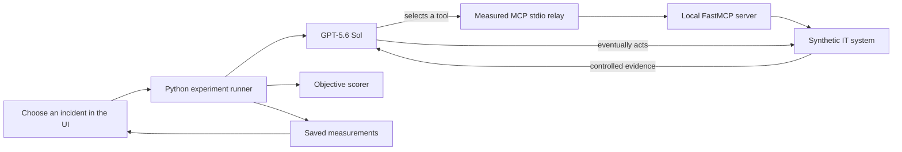

# MCP Traffic Analysis

An empirical performance study of agentic AI systems.

## What is this project?

This repository is a laboratory for measuring how an AI agent communicates and behaves while using Model Context Protocol (MCP) tools.

The current experiment gives a real AI agent one of three concrete, synthetic IT incident tickets. Each ticket can be implemented as a sequential, conditional-branching, or recovery task. The agent investigates through MCP tools, attempts a simulated remediation, and returns a structured answer. The system records the execution trace and scores it against known ground truth.

The IT incident application is the experimental setting. The main subject is the agent’s performance:

- latency;
- MCP traffic and exact local frame bytes;
- model and tool-call counts;
- token usage and estimated cost;
- tool ordering and trace variability;
- rejected and prohibited actions;
- objective task success and failure.

In one line:

```text
one incident → one agent → several MCP calls → one action → one measured observation
```

## What happens during one run?



For example, a checkout trace may be:

```text
get_alert
→ get_metrics
→ search_logs
→ get_dependencies
→ get_recent_changes
→ get_runbook
→ rollback_deployment
```

The model chooses this order. It is not hard-coded.

## What is an MCP “packet” here?

In the current phase, the agent and MCP server are separate local Python processes. They exchange newline-delimited JSON-RPC messages through operating-system `stdio` pipes.

```text
agent process → measurement relay → MCP server process
```

The relay records each message and forwards the same bytes unchanged.

This is an application-layer MCP frame, not an IP packet. The project does not yet capture HTTP, TLS, TCP, or IP traffic.

## What is measured?

For run $r$:

| Quantity | Meaning |
|---|---|
| $N_{\mathrm{model},r}$ | number of model calls |
| $N_{\mathrm{MCP},r}$ | number of MCP tool calls |
| $L_{\mathrm{total},r}$ | total time from run start to terminal result |
| $L_{\mathrm{model},r}$ | time spent in model requests |
| $L_{\mathrm{MCP},r}$ | client-observed MCP tool-call time |
| $L_{\mathrm{handler},r}$ | time inside the MCP server’s Python handlers |
| $B_{\mathrm{request},r}$ | exact bytes sent toward the local MCP server |
| $B_{\mathrm{response},r}$ | exact bytes returned by the local MCP server |
| $C_r$ | estimated token cost |
| $Y_r$ | objective task-success indicator |

The run-level latency decomposition is

$$
L_{\mathrm{total},r}
=L_{\mathrm{model},r}
+L_{\mathrm{MCP},r}
+L_{\mathrm{orchestration},r}.
$$

Server-handler time is nested inside MCP time and reported separately. It is not added twice.

## How is an agent scored?

Every synthetic incident contains hidden ground truth. A run succeeds only when all five conditions hold:

1. The diagnosis identifies the correct cause.
2. The final answer contains the required evidence IDs.
3. The exact required remediation and target were executed.
4. No prohibited action was attempted.
5. The synthetic incident ended in the resolved state.

Therefore,

$$
Y_r=I(D_r\land E_r\land A_r\land S_r\land R_r).
$$

These are deterministic Python checks. The project does not use another language model as a judge.

## Current incident scenarios

| Scenario | Hidden ground-truth cause | Required action |
|---|---|---|
| Checkout failures | defective checkout deployment | roll back the identified deployment |
| Image-worker degradation | memory saturation on one worker | restart the affected worker |
| Orders API outage | identity-service dependency outage | escalate to the recorded service owner |

All remediation is simulated. No real infrastructure is restarted, rolled back, or modified.

## Study phases

| Phase | Question | Status |
|---|---|---|
| Phase 1 | Can MCP events, timing, ordering, concurrency, and failures be recorded correctly? | Complete |
| Phase 2 | Can exact `stdio` frame bytes and controlled latency effects be measured statistically? | Complete |
| Phase 3 | What does a real model-driven agent execution trace look like? | Complete |
| Phase 4 | How does hidden task structure change MCP work and stochastic trace variability? | Complete |
| Later | What happens under controlled arrival rates, contention, queues, and network transport? | Not implemented |

Phase 1 and Phase 2 deliberately used no model. They established the measurement system before agent behavior was introduced.

## Phase 3 pilot result

The corrected `incident-pilot-v2` campaign used 30 independent runs and 30 fresh MCP sessions: ten runs per incident family.

| Result | Observed value |
|---|---:|
| Successful terminal runs | 30/30 |
| Wilson 95% interval for success probability | $[0.886, 1.000]$ |
| MCP tool calls | 249 |
| Model calls | 279 |
| Median total latency | 20.10 s |
| Median model time | 17.72 s |
| Median MCP client RTT per run | 164 ms |
| Median nested handler time per run | 10 ms |
| Estimated total token cost | $1.0102 |

Success did not imply perfect behavior. Every orders run first attempted a rejected identity-service restart before correctly escalating. The action ledger revealed inefficiency that a final-answer-only evaluation would miss.

An earlier pilot is retained as invalid calibration evidence because its required escalation target was not exposed to the agent. It was corrected and rerun rather than silently rescored.

These results are descriptive. Ten observations per scenario are not enough for strong tail, causal, or reliability claims.

## Phase 4 main result

The completed balanced campaign used 90 fresh agent runs: three tickets, three hidden task structures, and ten repetitions of every combination. Recovery structure increased expected MCP calls by about 20.5% relative to sequential structure. The 95% confidence interval ranged from 16.7% to 24.4%. Branching showed no detectable call-count difference.

Overall success was 85/90. All five failures occurred in the orders recovery condition and shared the same path-dependent mistake: the agent retried escalation without rereading a runbook after the task state changed. This is why the study records ordered traces rather than only final answers.

See [`docs/results/phase4_task_structure_results.md`](docs/results/phase4_task_structure_results.md) for the pilot, main result, statistical explanations, trace variability, limitations, and artifact checksums.

## Run the workbench

Requirements:

- Python 3.13;
- Node.js and npm;
- `uv`;
- an OpenAI API key for live Phase 3 runs.

Install the project:

```powershell
uv --cache-dir .uv-cache python install 3.13
uv --cache-dir .uv-cache sync --locked --all-groups
npm install
```

Create an ignored `.env` file for live agent runs:

```dotenv
OPENAI_API_KEY=your_key_here
```

Start the production workbench:

```powershell
npm run demo
```

Open `http://127.0.0.1:8000` and choose one of the four surfaces:

- **Behavior study** — compare concrete tickets under sequential, branching, and recovery structures;
- **Incident Agent** — run and inspect one real agent observation;
- **Statistical study** — inspect the controlled Phase 2 experiment;
- **Phase 1 traces** — inspect deterministic recorder and failure scenarios.

The full paid campaign is intentionally not launched from the browser.

## Run the Phase 4 task-structure study

Validate the complete 27-run pilot design without model cost:

```powershell
uv --cache-dir .uv-cache run --all-groups python -m mcp_traffic_analysis.behavior.campaigns task-structure-pilot-check --stage pilot --mode deterministic
```

The live pilot uses the same command without `--mode deterministic`. The separate 90-run main study uses `task-structure-main-v1 --stage main`. Add `--resume` after an interruption or `--analyze-only` to rebuild derived outputs without model calls.

The number 90 is the complete balanced design:

$$
3\ \text{task structures}\times3\ \text{incident tickets}\times10\ \text{independent runs per cell}=90.
$$

## Run the repeated incident campaign

```powershell
uv run python -m mcp_traffic_analysis.agent_campaigns incident-pilot-v2
```

Recompute its derived analysis without making new model calls:

```powershell
uv run python -m mcp_traffic_analysis.agent_campaigns incident-pilot-v2 --analyze-only
```

Generated artifacts are ignored by Git and written below `artifacts/phase3/`.

## Phase 3 artifacts

One UI run creates:

```text
artifacts/phase3/incident-<run_id>/
├── manifest.json
├── world_state.json
├── agent_events.jsonl
├── model_calls.jsonl
├── mcp_events.jsonl
├── frames.jsonl
├── action_ledger.jsonl
├── final_output.json
├── score.json
├── run_measurement.json
└── detail.json
```

A campaign additionally creates `analysis.json`, progress and design manifests, and CSV/Parquet tables at five observational levels:

- runs;
- model calls;
- MCP calls;
- action attempts;
- ordered traces.

Calls within one run are nested measurements. The independent experimental unit is the complete fresh run/session.

## Project structure

```text
frontend/src/components/IncidentWorkbench.tsx  primary Phase 3 UI
frontend/src/components/BehaviorWorkbench.tsx  Phase 4 experiment and analysis UI
src/mcp_traffic_analysis/api/app.py            HTTP API
src/mcp_traffic_analysis/incidents/runner.py   one complete agent experiment
src/mcp_traffic_analysis/incidents/server.py   ten MCP tools
src/mcp_traffic_analysis/incidents/world.py    synthetic incidents and truth
src/mcp_traffic_analysis/transport/stdio_relay.py
                                                exact frame recorder
src/mcp_traffic_analysis/agent_campaigns.py    repeated campaign and analysis
src/mcp_traffic_analysis/behavior/             Phase 4 design, traces, models, campaigns
```

Read [`docs/CODE_FLOW.md`](docs/CODE_FLOW.md) for a plain-language walkthrough followed by the detailed technical reference.

## Validation

The completed Phase 4 gate passed:

- 70 Python tests;
- Ruff;
- strict mypy;
- 8 React component tests;
- production TypeScript/Vite build;
- 5 Playwright Chromium workflows;
- uv lockfile verification;
- Markdown and Git diff checks.

Automated agent tests use a deterministic credit-free path. Browser tests do not call the hosted model.

## Documentation

- [`docs/CODE_FLOW.md`](docs/CODE_FLOW.md) — start here for what happens during one run.
- [`docs/WORKBENCH_GUIDE.md`](docs/WORKBENCH_GUIDE.md) — how to read the UI and statistics.
- [`docs/phase3_it_incident_agent.md`](docs/phase3_it_incident_agent.md) — frozen Phase 3 protocol and measurement boundary.
- [`docs/phase4_task_structure.md`](docs/phase4_task_structure.md) — plain-language Phase 4 methods, commands, and interpretation.
- [`docs/planning/phase4_task_structure_plan.md`](docs/planning/phase4_task_structure_plan.md) — frozen concrete-task design and statistical plan.
- [`docs/results/phase4_task_structure_results.md`](docs/results/phase4_task_structure_results.md) — the single Phase 4 pilot and main result, with unfamiliar statistical terms explained in place.
- [`docs/results/phase3_incident_pilot_results.md`](docs/results/phase3_incident_pilot_results.md) — corrected pilot results and invalid-pilot audit.
- [`docs/phase2_statistical_baseline.md`](docs/phase2_statistical_baseline.md) — controlled factorial design and models.
- [`docs/results/phase2_baseline_results.md`](docs/results/phase2_baseline_results.md) — completed 960-run Phase 2 result memo.
- [`docs/IMPLEMENTATION_STATUS.md`](docs/IMPLEMENTATION_STATUS.md) — implemented capabilities and limitations.
- [`docs/DEMO_WORKFLOW.md`](docs/DEMO_WORKFLOW.md) — phase testing and branch workflow.
- [`docs/planning/phase1/mcp_traffic_analysis_research_protocol.md`](docs/planning/phase1/mcp_traffic_analysis_research_protocol.md) — broader research roadmap.

## What is not yet measured?

The current implementation does not support claims about:

- TCP/IP packet sizes or Internet RTT;
- TLS or HTTP overhead;
- queue length or queue waiting time;
- controlled arrival processes or server utilization;
- autonomy-level effects;
- multi-agent orchestration;
- production incident-response reliability.

Phase 4 does measure empirical trace distributions, transition frequencies, edit distance from an oracle, and path entropy. These are descriptive stochastic summaries; they do not yet establish a Markov or queueing model.

Those require new experimental phases. They will not be inferred from measurements that do not observe them.

## Technology

- Python 3.13 and uv
- OpenAI Agents SDK
- FastMCP
- FastAPI
- React, TypeScript, and Vite
- Plotly
- NumPy, pandas, SciPy, and statsmodels
- PyArrow
- NetworkX
- Matplotlib and seaborn

The cumulative tested implementation lives on `demo`. Phase branches are preserved for inspection; `main` is not changed without an explicit release decision.
