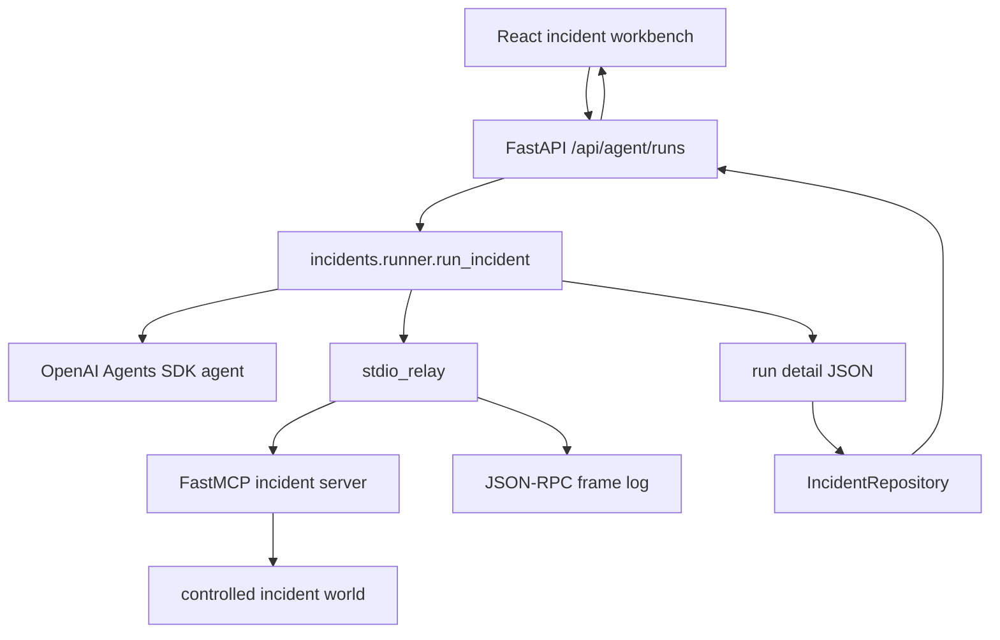

# Code flow

This repository has one measurement path. The browser is the primary demonstration surface.

## One run in plain language

1. The UI sends an incident choice and a run mode.
2. FastAPI calls `run_incident` and creates a fresh run directory.
3. The runner initializes a known synthetic world and starts the MCP server.
4. In live mode the model chooses observable tools through the Agents SDK. In deterministic mode a known valid sequence exercises the same server and measurement path without a model call.
5. The stdio relay records MCP request/response frames. The server records handler timing and applies simulated state changes.
6. The runner reconciles model, MCP, handler, and orchestration timings, computes tokens/cost/bytes, scores the final state, and writes `detail.json`.
7. The repository reads saved run details and the UI renders the run as one statistical observation.

## What is measured

At the run level: success/failure, model and MCP call counts, total/model/MCP/handler/orchestration latency, token counts, estimated cost, exact local stdio frame bytes, ordered tool names, rejected actions, and objective score components.

The frame boundary is application-layer MCP/JSON-RPC over local stdio. It is not a TCP/IP packet measurement. A quantity is shown as unavailable rather than estimated when the instrumentation cannot support it.

## Active-path rule

The active UI no longer exposes former phase dashboards or model-comparison reports. Historical analysis remains recoverable from `archive/pre-reset-2026-09-15`. New statistical analyses must begin with a written estimand, experimental unit, data dictionary, and stopping rule in the protocol before a campaign is run.
