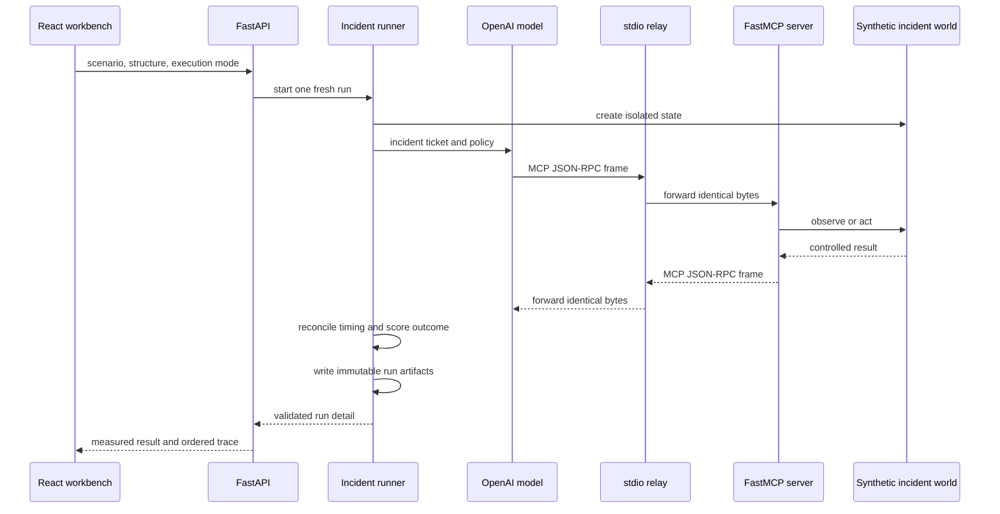
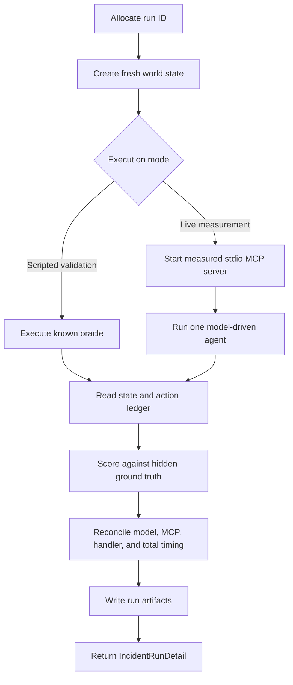

# Code Flow

This document follows one active experiment from the browser to the saved statistical artifact. The repository now contains two study surfaces: the Phase 3 incident agent and the Phase 4 task-structure experiment.

## One-run overview



## UI and API

`frontend/src/App.tsx` selects one of two workbenches:

- `IncidentWorkbench` uses `/api/agent/*` for Phase 3;
- `BehaviorWorkbench` uses `/api/behavior/*` for Phase 4.

The browser can launch one run. It cannot launch a repeated paid campaign. Campaign collection remains an explicit CLI operation.

`api/app.py` owns only HTTP concerns:

- validate request models;
- select the correct artifact repository;
- reject live runs when the API key is unavailable;
- call the experiment runner;
- return saved runs and campaign analyses; and
- serve allow-listed result tables and the production frontend.

The API does not calculate scientific results independently of the campaign analysis modules.

## Incident runner

`incidents/runner.py` owns one complete experimental observation.



Live runs use one `MCPServerStdio` context and one fresh agent. SDK hooks record model and tool timing. The model sees only the incident ticket and MCP tools; it does not receive the hidden cause or oracle.

Scripted validation executes the known valid path without calling a model. Its artifacts explicitly mark model tokens, live latency, and stdio bytes as unavailable.

## MCP server and task world

`incidents/server.py` exposes ten typed MCP tools. Each tool delegates to `incidents/world.py`, which owns the deterministic synthetic state machine.

The world records:

- evidence that has been observed;
- accepted, rejected, and prohibited actions;
- whether recovery prerequisites are satisfied; and
- whether the incident is resolved.

All remediation changes only the run’s JSON state file.

Phase 4 keeps the visible ticket constant while varying the hidden task graph:

- sequential;
- branching; or
- recovery.

Every shortest valid Phase 4 path contains five MCP calls.

## Exact stdio measurement

`transport/stdio_relay.py` sits between the model-side MCP client and the incident server process.

```text
agent process -> relay stdin -> incident server
agent process <- relay stdout <- incident server
```

For every newline-delimited frame, the relay records:

- direction;
- sequence number;
- monotonic and wall-clock timestamps;
- JSON-RPC message type, ID, and MCP method when parseable;
- payload, delimiter, and total frame bytes; and
- SHA-256 payload hash.

The relay forwards the original bytes unchanged. It stores metadata and hashes, not request or response bodies.

The `TransportFrame` model enforces

$$
B_{\mathrm{frame}}=B_{\mathrm{payload}}+B_{\mathrm{delimiter}}.
$$

This boundary measures local MCP/JSON-RPC frames. It does not observe network packets.

## Scoring and latency accounting

A run succeeds only if the deterministic scorer confirms:

1. the diagnosis identifies the hidden cause;
2. all required evidence IDs are returned;
3. the exact required action and target were accepted;
4. no prohibited action was attempted; and
5. the final synthetic state is resolved.

The run-level latency accounting is

$$
L_{\mathrm{total},r}
=L_{\mathrm{model},r}
+L_{\mathrm{MCP},r}
+L_{\mathrm{orchestration},r}.
$$

Handler time is nested inside MCP client time and is shown separately. It is not added twice.

## Phase 3 campaigns

`agent_campaigns.py` freezes and executes the repeated Phase 3 campaign. It writes progress after every run, supports resumption, and rebuilds derived tables without new model calls.

Its tables represent:

- runs;
- model calls;
- MCP calls;
- action attempts; and
- ordered traces.

Calls are nested within runs. The complete fresh run/session is the experimental unit.

## Phase 4 campaigns and analysis

`behavior/campaigns.py` creates balanced pilot and main schedules. The main design has nine conditions in each of ten randomized blocks.

`behavior/analysis.py` constructs run, call, action, trace, and transition tables. Its primary outcome is the MCP-call count:

$$
\log(\mu_r)
=\beta_0
+\beta_B I(\text{branching}_r)
+\beta_R I(\text{recovery}_r)
+\gamma_{\text{incident}(r)}
+\delta_{\text{block}(r)}.
$$

The primary estimator is a Poisson log-mean model with HC3 robust uncertainty. The negative-binomial sensitivity model is used only when the frozen overdispersion trigger is met.

The analysis also reports:

- Wilson success intervals;
- excess calls relative to the five-call oracle;
- normalized oracle distance;
- empirical path frequencies and entropy;
- empirical tool-transition probabilities; and
- exploratory latency, byte, token, and cost models.

## Artifact ownership

One live run writes a directory containing world state, model events, MCP events, exact frames, actions, structured output, score, reconciled measurements, and the combined detail object.

Campaign directories add:

- frozen design and progress manifests;
- `analysis.json`; and
- CSV and Parquet tables.

Raw generated artifacts are ignored by Git. Research methods and result memos are version controlled.

## Reading order

For the active system, read:

1. `frontend/src/components/BehaviorWorkbench.tsx` or `IncidentWorkbench.tsx`;
2. `api/app.py`;
3. `incidents/runner.py`;
4. `transport/stdio_relay.py`;
5. `incidents/server.py` and `incidents/world.py`; and
6. `behavior/campaigns.py` and `behavior/analysis.py` for repeated Phase 4 work.
