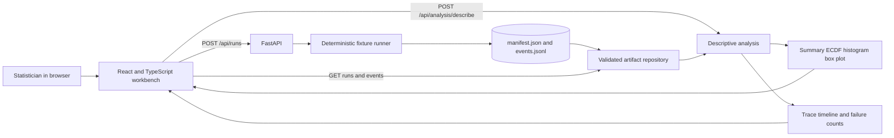
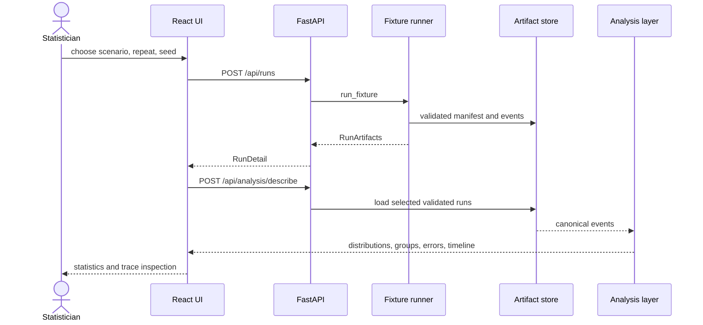
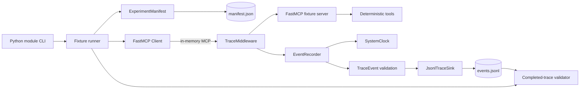
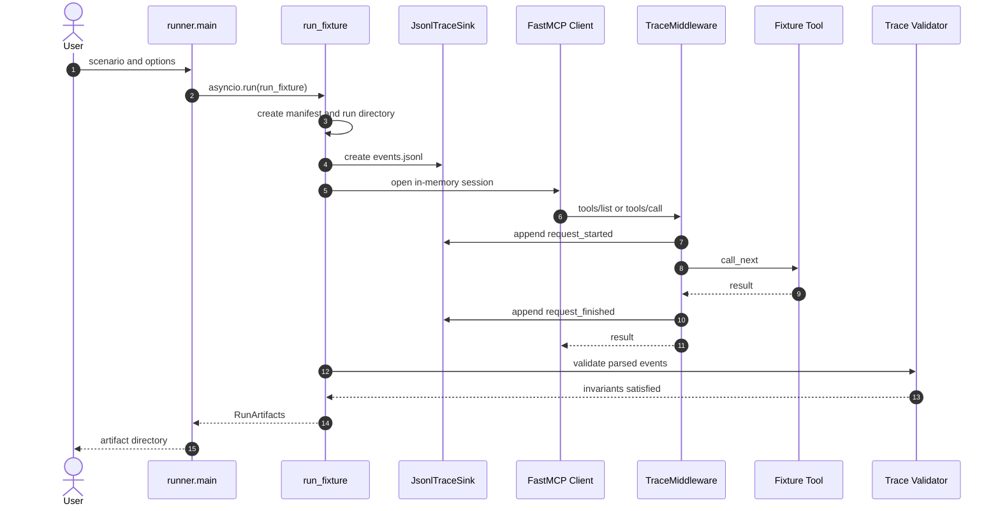
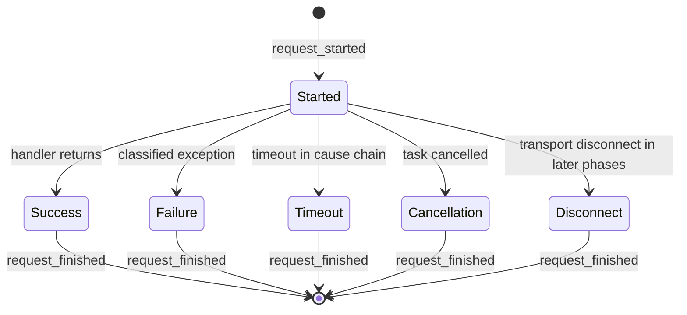
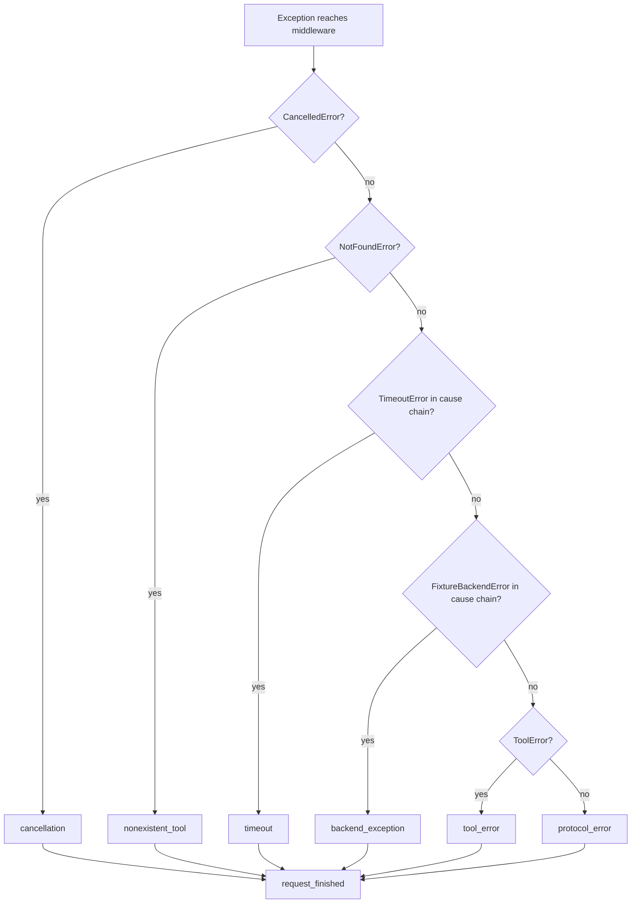
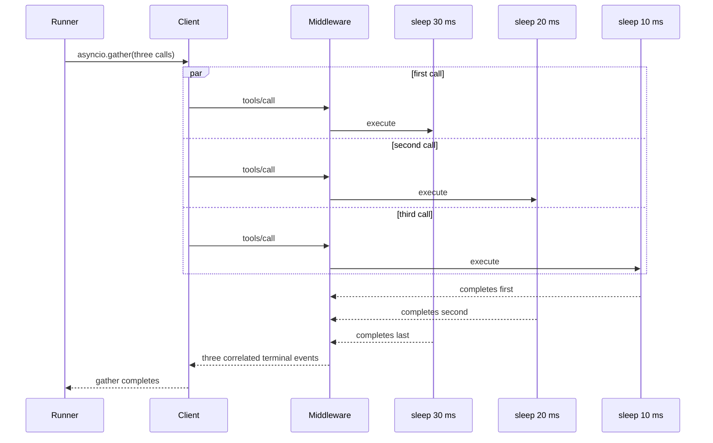
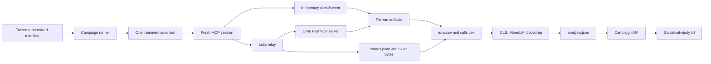
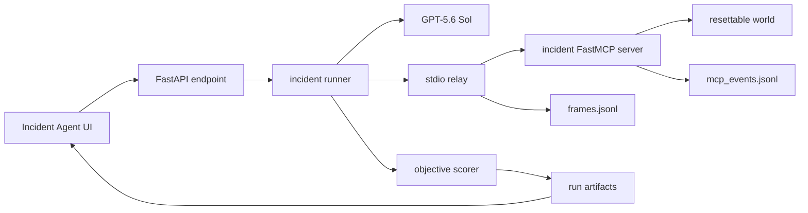

# Code Flow

This document explains the Phase 1 recorder, Phase 2 statistical baseline, and Phase 3 measured incident agent. It covers the deterministic measurement core, real `stdio` frame boundary, real-agent correlation, campaign analysis, FastAPI application, and React/TypeScript workbench.

The code has one deliberate boundary: it observes normalized MCP activity inside FastMCP, but it does not yet observe serialized JSON-RPC bytes or transport frames.

## Package map

| Module | Responsibility |
|---|---|
| `fixtures.runner` | Parses the command, creates a run manifest, executes a scenario, validates the trace, and reports the artifact directory. |
| `fixtures.server` | Builds a fresh FastMCP server with deterministic tools. |
| `fixtures.middleware` | Intercepts `tools/list` and `tools/call`, times server handling, and classifies terminal outcomes. |
| `measurement.models` | Defines the strict, versioned `ExperimentManifest` and `TraceEvent` contracts. |
| `measurement.clock` | Pairs UTC wall-clock observations with monotonic nanoseconds. |
| `measurement.recorder` | Adds correlation identifiers, process information, and atomic sequence numbers. |
| `measurement.sink` | Creates and durably appends to a JSONL trace without overwriting an existing run. |
| `measurement.validation` | Enforces completed-trace invariants after a trial. |
| `analysis.descriptive` | Computes finite-value summaries, linear quantiles, ECDF points, and reproducible histograms. |
| `api.repository` | Reads only validated run directories below the configured artifact root. |
| `api.trace_analysis` | Derives run summaries, call/run distributions, grouped statistics, errors, and timeline spans. |
| `api.app` | Exposes typed experiment, artifact, event, and analysis endpoints and serves the production UI. |
| `transport.stdio_relay` | Proxies newline-delimited JSON-RPC between the MCP client and child server, retaining exact bytes, hashes, direction, and protocol identifiers. |
| `experiments.condition_runner` | Runs one fresh controlled Phase 2 session and writes its raw artifacts. |
| `campaigns` | Freezes, randomizes, resumes, and completes the 48-cell Phase 2 campaign. |
| `analysis.phase2_models` | Builds analysis tables, fits run- and call-level models, and computes run-cluster bootstrap summaries. |
| `api.campaign_repository` | Reads a completed campaign safely without treating browser state as data. |
| `demo` | Starts the combined production workbench with Uvicorn. |
| `frontend/src/App.tsx` | Coordinates experiment creation, run selection, analysis unit, active-run events, and UI state. |
| `frontend/src/components` | Renders experiment controls, empirical distributions, timelines, summaries, and event tables. |

## Demo application flow



The browser never computes the authoritative statistics. It sends selected run identifiers and the experimental unit (`call` or `run`) to the Python analysis layer. This keeps quantile and histogram definitions testable and consistent across interfaces.

### API paths

| Route | Purpose |
|---|---|
| `GET /api/scenarios` | Describe the nine deterministic scenarios. |
| `POST /api/runs` | Execute, validate, persist, and return one experiment run. |
| `GET /api/runs` | List validated run summaries. |
| `GET /api/runs/{run_id}` | Read one manifest and run summary. |
| `GET /api/runs/{run_id}/events` | Read the canonical ordered event stream. |
| `POST /api/analysis/describe` | Describe selected runs at call or run level. |



## Component architecture



The FastMCP client and server run in one Python process. The in-memory transport exercises initialization, tool discovery, input validation, dispatch, and error conversion without a subprocess or network connection.

## Entry point and run lifecycle

A command such as:

```powershell
uv --cache-dir .uv-cache run python -m mcp_traffic_analysis.fixtures.runner concurrent
```

enters `fixtures.runner.main()` and follows this path:

1. `build_parser()` validates the scenario, output directory, repetition count, and seed.
2. `main()` starts the asynchronous runtime with `asyncio.run()`.
3. `run_fixture()` creates a privacy-safe manifest and a unique run directory.
4. `JsonlTraceSink.create()` creates a new `events.jsonl` and refuses to overwrite an existing file.
5. `EventRecorder` binds the manifest, sink, component identity, trace ID, and clocks.
6. `create_fixture_server()` registers middleware and three deterministic tools.
7. `Client(server)` opens an in-memory FastMCP session.
8. `execute_scenario()` performs the selected MCP operation one or more times.
9. The client session closes, the JSONL file is read back, and `validate_completed_trace()` checks it.
10. The runner prints the run directory only after validation succeeds.



## Request-span lifecycle

Middleware records only normalized FastMCP requests whose method is `tools/list` or `tools/call`. Initialization and other message types pass through without Phase 1A events.

Each observed request receives a new `span_id`. The start and terminal events share that ID, along with the run's `experiment_id`, `run_id`, and `trace_id`.



A start event has `outcome=started` and no latency. A terminal event has exactly one non-started outcome and a non-negative latency. Failed terminal events must also have an `error_type`.

### Timing boundary

The middleware writes the start event before invoking `call_next`. It then samples the monotonic clock immediately around server handling:

```text
write start event
sample call_start
await call_next
sample finish
write terminal event
```

Therefore `latency_ms` measures FastMCP server handling and deterministic tool execution. JSONL write time is outside that duration. UTC timestamps locate events in calendar time; monotonic nanoseconds define durations and ordering within the process.

## Successful tool call

For `echo`, `sleep`, or a successful branch of `concurrent`:

1. FastMCP may first issue `tools/list` as part of discovery.
2. Middleware appends a start event with direction `inbound`.
3. The server resolves and executes the tool.
4. Middleware appends a successful terminal event with direction `outbound`.
5. The client receives the tool result.

The recorder does not retain tool arguments or returned payload bodies. In Phase 1A, `payload_bytes`, `frame_bytes`, `payload_hash`, and `jsonrpc_id` remain null because the middleware did not observe their wire representation.

## Failure flow

FastMCP preserves causes when it converts a backend exception into a `ToolError`. The middleware walks that exception chain and stores only the class-based category, never the exception message.



The current scenarios produce five distinct failure outcomes:

| Scenario | Ground-truth classification |
|---|---|
| `backend_exception` | `backend_exception` |
| `tool_error` | `tool_error` |
| `timeout` | `timeout` |
| `nonexistent_tool` | `nonexistent_tool` |
| `cancellation` | `cancellation` |

## Concurrent calls

The concurrent scenario starts three `sleep_ms` calls with different service times. All use independent span IDs. Event sequence numbers record append order, not a claim that the work was sequential.



FastMCP may interleave additional `tools/list` requests during concurrent client activity. These are real protocol interactions and remain in the trace. Tests therefore assert causal and span invariants rather than assuming one fixed global event sequence.

## Artifact flow

Every run creates a unique directory:

```text
artifacts/phase1a/<scenario>-<run_id>/
├── manifest.json
└── events.jsonl
```

`manifest.json` describes the experimental condition, transport, scenario seed, software versions, and non-identifying host characteristics. `events.jsonl` contains one validated `TraceEvent` per line.

The sink opens the trace in append mode, writes one line, flushes it, and calls `fsync`. Sequence assignment and sink writes share an asynchronous lock, so file order and sequence-number order agree within the process.

## Trace invariants

The validator requires:

- one non-empty trace file per run;
- sequence numbers equal to `0, 1, ..., n-1` in file order;
- one `trace_id` and one `run_id` per file;
- exactly two events per span;
- `request_started` before `request_finished`;
- one terminal outcome per request;
- nondecreasing monotonic time within a span;
- stable method and tool identity across the span.

Pydantic adds field-level and cross-field constraints, including strict schema fields, UTC timestamps, frozen top-level models, and prevention of unobserved byte claims for in-memory events.

## Scenario and test coverage

| Behavior | Primary implementation | Validation |
|---|---|---|
| Schema and event semantics | `measurement.models` | strict fields, frozen events, UTC, latency rules, byte-policy rules |
| Atomic append order | `measurement.recorder` and `measurement.sink` | 20 concurrent emissions retain contiguous sequence numbers |
| Discovery and tool calls | `fixtures.runner` and `fixtures.server` | 20-trial scenario matrix |
| Controlled service time | `sleep_ms` | observed handler latency is at least the configured delay tolerance |
| Failure taxonomy | `fixtures.middleware` | expected error class per failure scenario |
| Concurrency | `asyncio.gather` | three starts occur before the first tool terminal event |
| Privacy | all recording paths | no API-key name, arguments, or backend message in JSONL |
| Completed traces | `measurement.validation` | every generated run passes span and ordering invariants |

The Python suite contains 37 tests, including the 20-trial in-memory matrix and API/statistical tests. Three Vitest component tests cover the experiment form, statistics panel, and timeline. Two Playwright tests cover successful repeated execution, concurrency, classified failure, and persistence through reload.

## Boundary for Phase 1B

Phase 1A can answer which normalized MCP methods and tools ran, in what causal spans, for how long at the server boundary, and with what classified outcome.

It cannot yet answer the exact JSON-RPC request size, response size, frame size, wire ID, subprocess overhead, or transport latency. Phase 1B must add observation at a real `stdio` boundary rather than infer those values from Python objects.

## Phase 2: controlled transport and statistical flow

Phase 2 implements that real boundary and turns it into a deliberately small factorial study. `roundtrip_payload` returns a known-length payload after a programmed delay. The campaign runner creates a fresh session for every independent run, so calls within the same run are never mistaken for independent experimental replicates.



For `stdio`, the child server uses standard input and output exclusively for MCP frames. The relay pumps each complete frame unchanged, records its actual byte length including line ending, computes a checksum, and maps JSON-RPC IDs back to the call metadata. Server diagnostic output is captured separately in `server.stderr.log`, so it cannot corrupt the protocol stream.

The campaign CLI is the authority for a full 960-run collection. It writes `progress.json` after each run and can resume an interrupted collection. At completion, `analysis.phase2_models` derives run-level medians, call-level records, HC3 OLS estimates, a random-run-intercept mixed model, and a within-condition run bootstrap. The UI reads those saved artifacts and can make a small calibration run; it does not silently launch the scientific campaign in a browser request.

## Phase 3 real-agent flow



`incidents.world` owns ground truth and state transitions. `incidents.server` exposes evidence and simulated-action tools. `incidents.runner` owns the model run, hooks, byte correlation, decomposition, cost estimate, and terminal artifacts. `agent_campaigns` freezes and summarizes the 30-run pilot.
