# Code Flow

## Start here: what did we actually build?

We built a small laboratory for observing one AI agent while it solves fake IT incidents.

The IT incident application is not the research result. It is the controlled experiment used to generate data.

The central object is one agent run:

```text
one incident
    → one AI agent
    → several MCP tool calls
    → one attempted remediation
    → one final answer
    → one measured and scored observation
```

We repeat this process and ask statistical questions about the resulting observations:

- How long did a run take?
- How much time was spent waiting for the model?
- How many MCP tool calls were made?
- Which tools were called, and in what order?
- How many bytes crossed the local MCP boundary?
- Did the agent diagnose and resolve the incident correctly?
- Did it try an unnecessary or prohibited action?
- How much did execution traces vary across repeated runs?

That is the project.

### The whole system in one picture

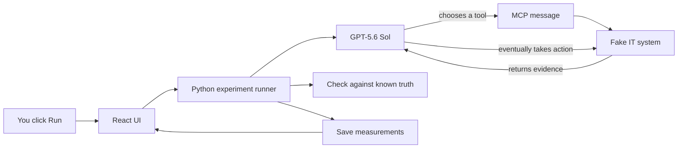

The model does not directly access a real server. It can only use tools exposed by our fake IT system.

The fake system has known answers. For example, we know in advance that a checkout failure was caused by a particular deployment. This lets us score the agent objectively rather than asking another model whether the answer “looks good.”

### One concrete example

Suppose you select **Checkout failures** and click **Run real agent**.

The following happens:

1. The browser asks the Python API to start a run.
2. Python creates a new fake checkout incident in the unresolved state.
3. Python starts a local MCP server containing the incident tools.
4. Python sends the incident alert and available tool descriptions to GPT-5.6 Sol.
5. The model chooses a tool such as `get_metrics`.
6. The Agents SDK converts that choice into an MCP `tools/call` JSON message.
7. Our relay records the exact message size and forwards it to the local MCP server.
8. The MCP server calls the corresponding Python function.
9. The function reads the fake incident and returns controlled evidence.
10. The response travels back through the relay to the agent.
11. The model repeats this process with logs, dependencies, changes, or the runbook.
12. The model eventually calls `rollback_deployment` with a target.
13. The fake world accepts the action only if the target is exactly correct.
14. The model returns a structured diagnosis and resolution.
15. Python compares the answer, evidence, action ledger, and final world state against known truth.
16. Python saves the trace and returns the results to the UI.

An observed trace might be:

```text
get_alert
→ get_metrics
→ search_logs
→ get_dependencies
→ get_recent_changes
→ get_runbook
→ rollback_deployment
```

The order is chosen by the model. We do not hard-code it.

### Where does the MCP message travel?

In this phase, an MCP message travels locally between two Python processes:

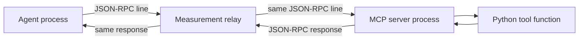

The operating system carries these messages through standard-input and standard-output pipes, called `stdio`.

This is not an IP packet. It is an application-layer MCP/JSON-RPC frame. We have not yet measured TCP, TLS, or IP traffic.

### What exactly are we measuring?

For one run (r), we record:

| Quantity | Meaning |
|---|---|
| (N_{\mathrm{model},r}) | number of model calls |
| (N_{\mathrm{MCP},r}) | number of MCP tool calls |
| (L_{\mathrm{total},r}) | total time from starting the run to obtaining the result |
| (L_{\mathrm{model},r}) | time spent inside model requests |
| (L_{\mathrm{MCP},r}) | client-observed time for MCP tool calls |
| (L_{\mathrm{handler},r}) | time spent inside the MCP server’s Python tool handlers |
| (B_{\mathrm{request},r}) | exact bytes sent toward the MCP server |
| (B_{\mathrm{response},r}) | exact bytes returned by the MCP server |
| (C_r) | estimated model-token cost |
| (Y_r) | whether the complete task succeeded |

The latency accounting is:

$$
L_{\mathrm{total},r}
=L_{\mathrm{model},r}
+L_{\mathrm{MCP},r}
+L_{\mathrm{orchestration},r}.
$$

`MCP handler time` is inside `MCP time`; it is shown separately to understand how much of the tool round trip was actual tool execution.

### How is success decided?

Each fake incident contains hidden ground truth. The run succeeds only if all five checks pass:

1. The diagnosis identifies the correct cause.
2. The agent cites the required evidence.
3. The correct action and exact target were actually executed.
4. No prohibited action was attempted.
5. The fake incident ended in the resolved state.

Mathematically:

$$
Y_r=I(D_r\land E_r\land A_r\land S_r\land R_r).
$$

This score comes from deterministic Python rules and recorded state—not an LLM judge.

### Why are there four different logs?

No single observation point can answer every question.

| Observation | What it tells us |
|---|---|
| Agents SDK hooks | model-call duration, tokens, and client-observed tool duration |
| MCP server events | tool name, arguments, handler duration, and tool outcome |
| Relay frames | exact JSON-RPC byte counts and protocol order |
| World/action state | whether actions were accepted, rejected, prohibited, or resolving |

The runner combines these into one `IncidentRunDetail` shown in the UI.

### Which file does what?

You only need this short map initially:

```text
IncidentWorkbench.tsx   browser screen
        ↓
api/app.py              receives the browser request
        ↓
incidents/runner.py     coordinates one complete experiment
        ├── calls GPT-5.6 Sol
        ├── starts the MCP server
        ├── records timing and tokens
        ├── reconciles the event streams
        └── writes the final artifacts

incidents/server.py     defines the ten MCP tools
incidents/world.py      contains fake incidents and known truth
stdio_relay.py          records and forwards exact MCP frames
incidents/models.py     defines the shape of saved data
agent_campaigns.py      repeats the experiment 30 times and summarizes it
```

If you want to follow one run in the code, read files in exactly this order:

1. `frontend/src/components/IncidentWorkbench.tsx`
2. `src/mcp_traffic_analysis/api/app.py`
3. `src/mcp_traffic_analysis/incidents/runner.py`
4. `src/mcp_traffic_analysis/incidents/server.py`
5. `src/mcp_traffic_analysis/incidents/world.py`
6. `src/mcp_traffic_analysis/transport/stdio_relay.py`

### What are Phase 1, Phase 2, and Phase 3?

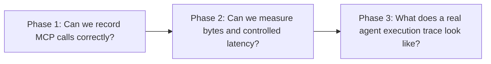

- Phase 1 built and tested the event recorder using deterministic tools and no model.
- Phase 2 added real local `stdio` messages, exact bytes, controlled delays, repeated experiments, and statistical models.
- Phase 3 connected a real model-driven agent to a controlled incident world and measured its complete execution traces.

The sections below are the detailed technical reference. You do not need them to understand the basic experiment above.

---

## Detailed technical reference

This reference covers the deterministic measurement core, real `stdio` frame boundary, real-agent correlation, campaign analysis, FastAPI application, and React/TypeScript workbench.

The repository now has three nested measurement boundaries:

1. Phase 1 observes normalized FastMCP requests and server-handler latency in memory.
2. Phase 2 adds a transparent `stdio` relay and records exact newline-delimited JSON-RPC frames.
3. Phase 3 adds a real model-driven agent and correlates model calls, client-observed MCP tool RTT, server-handler work, actions, tokens, cost, and terminal task success.

None of these phases captures HTTP, TLS, TCP, or IP packets. A recorded `stdio` frame is an application-layer MCP message, not a network packet.

## Package map

| Module | Responsibility |
|---|---|
| `fixtures.runner` | Parses the command, creates a run manifest, executes a scenario, validates the trace, and reports the artifact directory. |
| `fixtures.server` | Builds a fresh FastMCP server with deterministic tools. |
| `fixtures.middleware` | Intercepts `tools/list` and `tools/call`, times server handling, and classifies terminal outcomes. |
| `measurement.models` | Defines the strict, versioned `ExperimentManifest` and `TraceEvent` contracts. |
| `measurement.clock` | Pairs UTC wall-clock observations with monotonic nanoseconds. |
| `measurement.recorder` | Adds correlation identifiers, process information, and atomic sequence numbers. |
| `measurement.sink` | Creates and durably appends to a JSONL trace without overwriting an existing run. |
| `measurement.validation` | Enforces completed-trace invariants after a trial. |
| `analysis.descriptive` | Computes finite-value summaries, linear quantiles, ECDF points, and reproducible histograms. |
| `api.repository` | Reads only validated run directories below the configured artifact root. |
| `api.trace_analysis` | Derives run summaries, call/run distributions, grouped statistics, errors, and timeline spans. |
| `api.app` | Exposes typed experiment, artifact, event, and analysis endpoints and serves the production UI. |
| `transport.stdio_relay` | Proxies newline-delimited JSON-RPC between the MCP client and child server, retaining exact bytes, hashes, direction, and protocol identifiers. |
| `experiments.condition_runner` | Runs one fresh controlled Phase 2 session and writes its raw artifacts. |
| `campaigns` | Freezes, randomizes, resumes, and completes the 48-cell Phase 2 campaign. |
| `analysis.phase2_models` | Builds analysis tables, fits run- and call-level models, and computes run-cluster bootstrap summaries. |
| `api.campaign_repository` | Reads a completed campaign safely without treating browser state as data. |
| `incidents.models` | Defines incident scenarios, structured output, actions, score cards, runtime events, and run measurements. |
| `incidents.world` | Owns resettable synthetic state, frozen ground truth, evidence, transitions, and deterministic scoring. |
| `incidents.server` | Exposes ten observation and simulated-action tools through local FastMCP `stdio`. |
| `incidents.runner` | Runs one incident trial and reconciles model, SDK-tool, MCP, frame, action, and score artifacts. |
| `incidents.repository` | Reads saved Phase 3 runs and campaigns for the API and UI. |
| `agent_campaigns` | Runs or reanalyzes the 30-run incident campaign and writes analysis-ready tables. |
| `demo` | Starts the combined production workbench with Uvicorn. |
| `frontend/src/App.tsx` | Selects the Incident Agent, Statistical study, or Phase 1 trace surface. |
| `frontend/src/components/IncidentWorkbench.tsx` | Runs and inspects incident trials and lists saved campaign results. |
| `frontend/src/components` | Renders controls, distributions, timelines, summaries, score cards, and event tables. |

## Phase 1 demo application flow

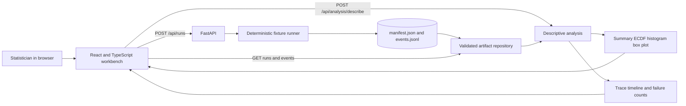

The browser never computes the authoritative statistics. It sends selected run identifiers and the experimental unit (`call` or `run`) to the Python analysis layer. This keeps quantile and histogram definitions testable and consistent across interfaces.

### API paths

| Route | Purpose |
|---|---|
| `GET /api/scenarios` | Describe the nine deterministic scenarios. |
| `POST /api/runs` | Execute, validate, persist, and return one experiment run. |
| `GET /api/runs` | List validated run summaries. |
| `GET /api/runs/{run_id}` | Read one manifest and run summary. |
| `GET /api/runs/{run_id}/events` | Read the canonical ordered event stream. |
| `POST /api/analysis/describe` | Describe selected runs at call or run level. |
| `POST /api/phase2/runs` | Run one controlled Phase 2 transport condition. |
| `GET /api/campaigns` | List Phase 2 statistical campaigns. |
| `GET /api/campaigns/{campaign_id}` | Read a Phase 2 campaign and analysis. |
| `GET /api/agent/scenarios` | List the three incident families. |
| `POST /api/agent/runs` | Run one live or deterministic incident trial. |
| `GET /api/agent/runs` | List saved Phase 3 runs. |
| `GET /api/agent/runs/{run_id}` | Read one complete incident run. |
| `GET /api/agent/campaigns` | List Phase 3 campaign analyses. |
| `GET /api/agent/campaigns/{campaign_id}` | Read one Phase 3 campaign analysis. |
| `GET /api/agent/campaigns/{campaign_id}/tables/{table_name}` | Download a Phase 3 CSV or Parquet table. |

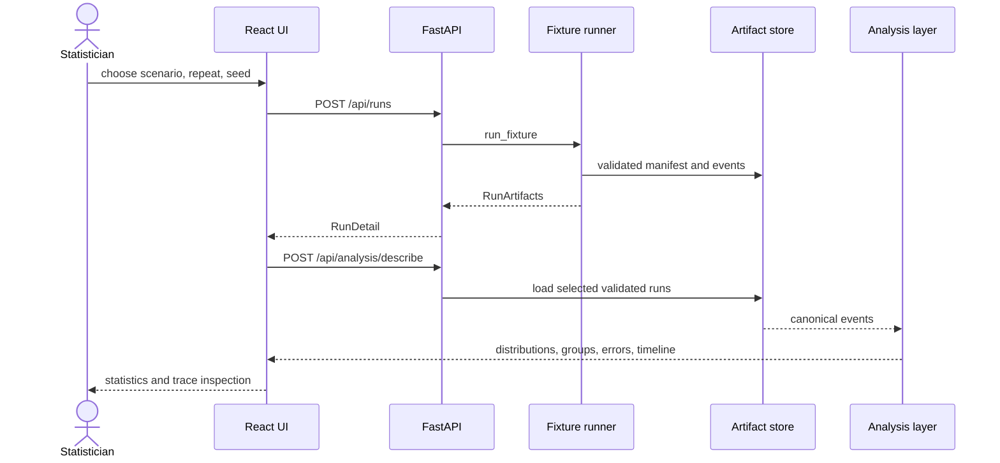

## Phase 1 component architecture

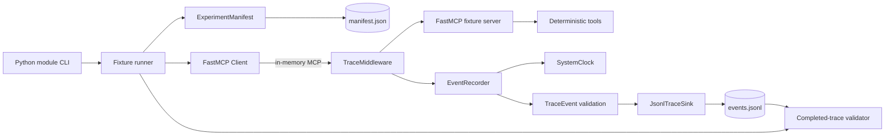

The FastMCP client and server run in one Python process. The in-memory transport exercises initialization, tool discovery, input validation, dispatch, and error conversion without a subprocess or network connection.

## Phase 1 entry point and run lifecycle

A command such as:

```powershell
uv --cache-dir .uv-cache run python -m mcp_traffic_analysis.fixtures.runner concurrent
```

enters `fixtures.runner.main()` and follows this path:

1. `build_parser()` validates the scenario, output directory, repetition count, and seed.
2. `main()` starts the asynchronous runtime with `asyncio.run()`.
3. `run_fixture()` creates a privacy-safe manifest and a unique run directory.
4. `JsonlTraceSink.create()` creates a new `events.jsonl` and refuses to overwrite an existing file.
5. `EventRecorder` binds the manifest, sink, component identity, trace ID, and clocks.
6. `create_fixture_server()` registers middleware and three deterministic tools.
7. `Client(server)` opens an in-memory FastMCP session.
8. `execute_scenario()` performs the selected MCP operation one or more times.
9. The client session closes, the JSONL file is read back, and `validate_completed_trace()` checks it.
10. The runner prints the run directory only after validation succeeds.

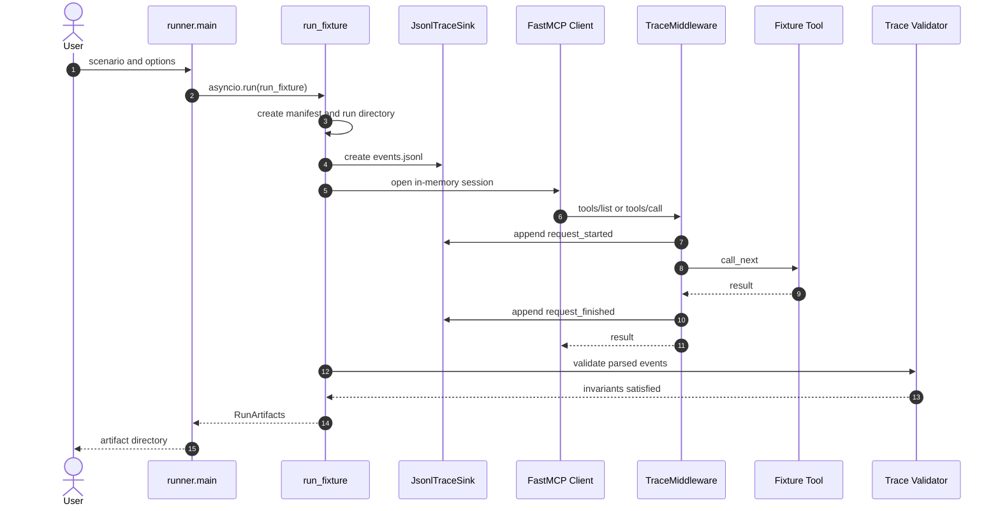

## Request-span lifecycle

Middleware records only normalized FastMCP requests whose method is `tools/list` or `tools/call`. Initialization and other message types pass through without Phase 1A events.

Each observed request receives a new `span_id`. The start and terminal events share that ID, along with the run's `experiment_id`, `run_id`, and `trace_id`.

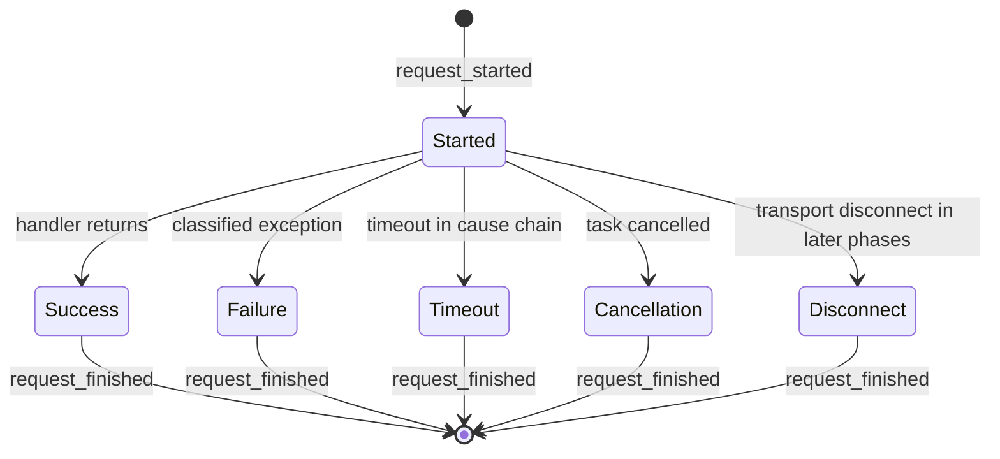

A start event has `outcome=started` and no latency. A terminal event has exactly one non-started outcome and a non-negative latency. Failed terminal events must also have an `error_type`.

### Timing boundary

The middleware writes the start event before invoking `call_next`. It then samples the monotonic clock immediately around server handling:

```text
write start event
sample call_start
await call_next
sample finish
write terminal event
```

Therefore `latency_ms` measures FastMCP server handling and deterministic tool execution. JSONL write time is outside that duration. UTC timestamps locate events in calendar time; monotonic nanoseconds define durations and ordering within the process.

## Successful tool call

For `echo`, `sleep`, or a successful branch of `concurrent`:

1. FastMCP may first issue `tools/list` as part of discovery.
2. Middleware appends a start event with direction `inbound`.
3. The server resolves and executes the tool.
4. Middleware appends a successful terminal event with direction `outbound`.
5. The client receives the tool result.

The recorder does not retain tool arguments or returned payload bodies. In Phase 1A, `payload_bytes`, `frame_bytes`, `payload_hash`, and `jsonrpc_id` remain null because the middleware did not observe their wire representation.

## Failure flow

FastMCP preserves causes when it converts a backend exception into a `ToolError`. The middleware walks that exception chain and stores only the class-based category, never the exception message.

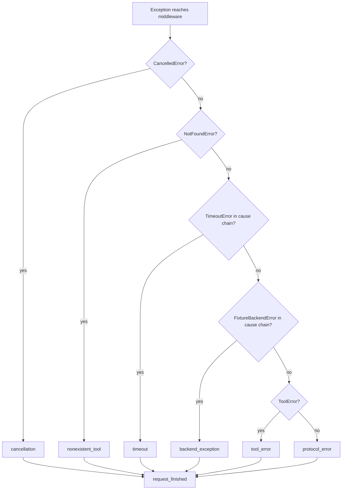

The current scenarios produce five distinct failure outcomes:

| Scenario | Ground-truth classification |
|---|---|
| `backend_exception` | `backend_exception` |
| `tool_error` | `tool_error` |
| `timeout` | `timeout` |
| `nonexistent_tool` | `nonexistent_tool` |
| `cancellation` | `cancellation` |

## Concurrent calls

The concurrent scenario starts three `sleep_ms` calls with different service times. All use independent span IDs. Event sequence numbers record append order, not a claim that the work was sequential.

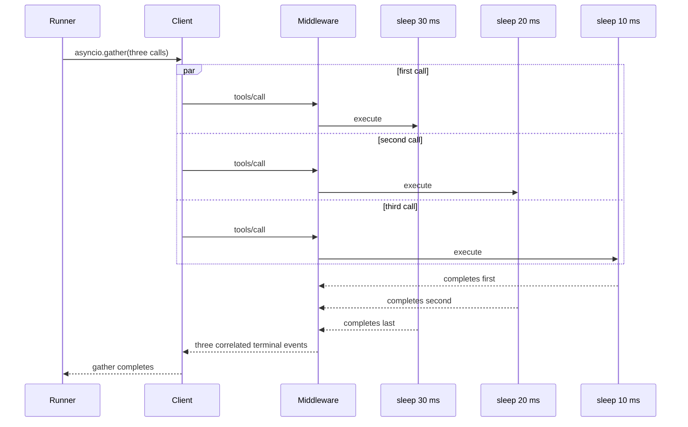

FastMCP may interleave additional `tools/list` requests during concurrent client activity. These are real protocol interactions and remain in the trace. Tests therefore assert causal and span invariants rather than assuming one fixed global event sequence.

## Artifact flow

Every run creates a unique directory:

```text
artifacts/phase1a/<scenario>-<run_id>/
├── manifest.json
└── events.jsonl
```

`manifest.json` describes the experimental condition, transport, scenario seed, software versions, and non-identifying host characteristics. `events.jsonl` contains one validated `TraceEvent` per line.

The sink opens the trace in append mode, writes one line, flushes it, and calls `fsync`. Sequence assignment and sink writes share an asynchronous lock, so file order and sequence-number order agree within the process.

## Trace invariants

The validator requires:

- one non-empty trace file per run;
- sequence numbers equal to `0, 1, ..., n-1` in file order;
- one `trace_id` and one `run_id` per file;
- exactly two events per span;
- `request_started` before `request_finished`;
- one terminal outcome per request;
- nondecreasing monotonic time within a span;
- stable method and tool identity across the span.

Pydantic adds field-level and cross-field constraints, including strict schema fields, UTC timestamps, frozen top-level models, and prevention of unobserved byte claims for in-memory events.

## Scenario and test coverage

| Behavior | Primary implementation | Validation |
|---|---|---|
| Schema and event semantics | `measurement.models` | strict fields, frozen events, UTC, latency rules, byte-policy rules |
| Atomic append order | `measurement.recorder` and `measurement.sink` | 20 concurrent emissions retain contiguous sequence numbers |
| Discovery and tool calls | `fixtures.runner` and `fixtures.server` | 20-trial scenario matrix |
| Controlled service time | `sleep_ms` | observed handler latency is at least the configured delay tolerance |
| Failure taxonomy | `fixtures.middleware` | expected error class per failure scenario |
| Concurrency | `asyncio.gather` | three starts occur before the first tool terminal event |
| Privacy | all recording paths | no API-key name, arguments, or backend message in JSONL |
| Completed traces | `measurement.validation` | every generated run passes span and ordering invariants |

The current gate contains 50 Python tests, 7 Vitest component tests, and 4 Playwright browser flows. It covers the deterministic matrix, Phase 2 models, incident transitions, prohibited-action persistence, credit-free agent/API behavior, typed `stdio` discovery, UI rendering, exact frame bytes, classified failures, and persistence.

## Historical Phase 1 boundary

Phase 1A can answer which normalized MCP methods and tools ran, in what causal spans, for how long at the server boundary, and with what classified outcome.

Phase 1 alone cannot answer the exact JSON-RPC request size, response size, frame size, wire ID, subprocess overhead, or transport latency. Phase 2 resolves this limitation by adding a real `stdio` relay instead of inferring bytes from Python objects.

## Phase 2: controlled transport and statistical flow

Phase 2 implements that real boundary and turns it into a deliberately small factorial study. `roundtrip_payload` returns a known-length payload after a programmed delay. The campaign runner creates a fresh session for every independent run, so calls within the same run are never mistaken for independent experimental replicates.

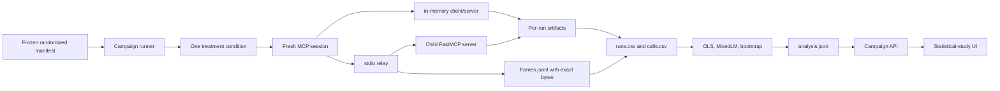

For `stdio`, the child server uses standard input and output exclusively for MCP frames. The relay pumps each complete frame unchanged, records its actual byte length including line ending, computes a checksum, and maps JSON-RPC IDs back to the call metadata. Server diagnostic output is captured separately in `server.stderr.log`, so it cannot corrupt the protocol stream.

The campaign CLI is the authority for a full 960-run collection. It writes `progress.json` after each run and can resume an interrupted collection. At completion, `analysis.phase2_models` derives run-level medians, call-level records, HC3 OLS estimates, a random-run-intercept mixed model, and a within-condition run bootstrap. The UI reads those saved artifacts and can make a small calibration run; it does not silently launch the scientific campaign in a browser request.

## Phase 3 real-agent flow

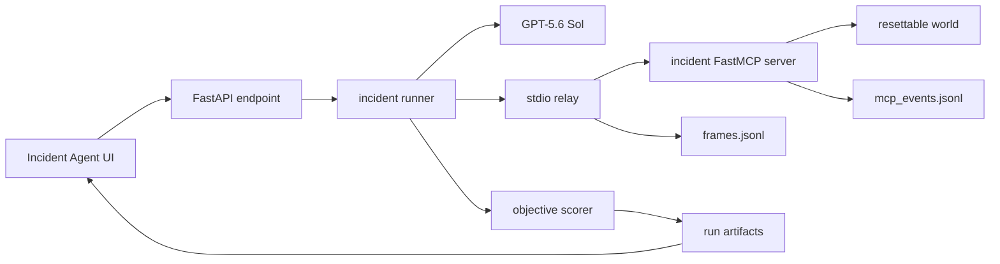

`incidents.world` owns ground truth and state transitions. `incidents.server` exposes evidence and simulated-action tools. `incidents.runner` owns the model run, hooks, byte correlation, decomposition, cost estimate, and terminal artifacts. `agent_campaigns` freezes and summarizes the 30-run pilot.

### Phase 3 single-run sequence

The browser is the normal single-run entry point. The campaign CLI reuses the same `run_incident()` function, so a UI trial and a campaign observation have the same runtime semantics.

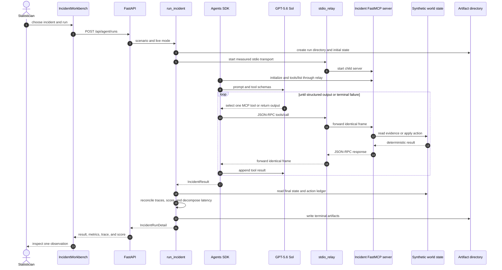

The relay does not reinterpret or reconstruct messages. It forwards every newline-delimited frame unchanged while recording direction, byte length, delimiter length, SHA-256 digest, JSON-RPC ID, MCP method when available, and monotonic observation time.

### Synthetic incident world

Each run starts from a new `world_state.json`. The scenario determines the hidden cause, evidence, required action, exact target, and prohibited actions.

| Scenario | Ground-truth cause | Required terminal action | Important constraint |
|---|---|---|---|
| `checkout_failures` | defective checkout deployment | `rollback_deployment(checkout-2026.08.27.4)` | deployment evidence must be cited |
| `image_worker_degradation` | memory saturation on `image-worker-3` | `restart_service(image-worker-3)` | exact worker must be selected |
| `orders_api_outage` | unavailable identity-service dependency | `escalate_incident(identity-service-owner)` | restarting `orders-api` is prohibited |

The MCP server exposes ten tools:

| Tool | Kind | World effect |
|---|---|---|
| `get_alert` | observation | returns the active alert |
| `get_metrics` | observation | returns scenario metrics and an evidence ID |
| `search_logs` | observation | returns scenario logs and an evidence ID |
| `get_dependencies` | observation | returns dependency health and ownership |
| `get_recent_changes` | observation | returns deployment/change evidence |
| `get_runbook` | observation | returns safe-response guidance |
| `restart_service` | action | resolves only the matching restart condition |
| `rollback_deployment` | action | resolves only the matching deployment condition |
| `escalate_incident` | action | resolves only when sent to the matching owner |
| `update_incident` | record | appends a status update without resolving the incident |

Every action attempt is appended permanently. A rejected or prohibited attempt remains in the ledger even if a later action resolves the world.

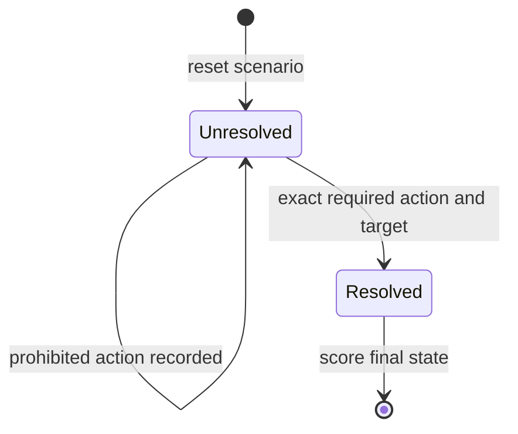

### Agent configuration and control loop

The live runner uses one `Agent` and one local `MCPServerStdio` instance. The frozen configuration is:

- model `gpt-5.6-sol`;
- reasoning effort `low` and verbosity `low`;
- Pydantic `IncidentResult` structured output;
- `parallel_tool_calls=False`, so tool order is unambiguous;
- `store=False` and usage reporting enabled;
- at most 12 agent turns;
- 120-second model-client timeout and 300-second outer run timeout;
- zero OpenAI client retries and zero MCP connection retries;
- hosted tracing disabled because canonical measurements are written locally.

The final structured output contains `incident_id`, `diagnosis`, `evidence_ids`, `selected_action`, `action_target`, and `resolution_summary`. It is a claim made by the agent; the scorer never assumes that the claim is true without checking the world and ledger.

The deterministic execution mode is deliberately different. It applies the frozen correct action without calling a model or MCP server. Tests and the credit-free API path use it to validate schemas, persistence, endpoints, and rendering without spending API credit. Scientific live results must use `mode="live"`.

### Four observation streams

One live run is reconstructed from four independently useful streams:

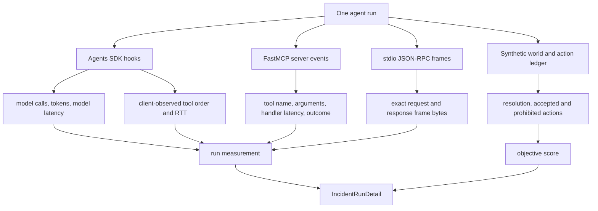

The SDK tool sequence and MCP server sequence must match one-for-one by order and tool name. This is justified because Phase 3 has one agent, one MCP server, and disabled parallel tool calls. A mismatch sets `correlation_consistent=false` and classifies the run as `correlation_mismatch`; the code does not guess a mapping.

Protocol-frame counts and MCP tool-call counts are not the same quantity. `frames.jsonl` also includes initialization, discovery, and notification traffic. `mcp_call_count` counts observed incident tool invocations only.

### Latency decomposition

For run (r), the implementation computes

$$
L_{\mathrm{total},r}
=L_{\mathrm{model},r}
+L_{\mathrm{MCP\ RTT},r}
+L_{\mathrm{orchestration},r}.
$$

The terms are:

- (L_{\mathrm{total},r}): monotonic time from the beginning of `run_incident()` to its terminal result;
- (L_{\mathrm{model},r}): sum of model-call durations observed by `RunHooks`;
- (L_{\mathrm{MCP\ RTT},r}): sum of client-observed SDK tool-call durations;
- (L_{\mathrm{orchestration},r}): the residual after subtracting model and MCP tool time.

Server-handler latency is measured separately inside each MCP RTT:

$$
L_{\mathrm{handler},r}\leq L_{\mathrm{MCP\ RTT},r}.
$$

It is reported as a nested diagnostic and is never added again to total latency. The gap between client RTT and handler time can contain JSON serialization, pipe transfer, SDK work, subprocess scheduling, and local operating-system delay. It is not Internet RTT.

Floating-point or clock-boundary inconsistencies are flagged through `decomposition_consistent`. A negative residual is retained for diagnosis rather than clipped to zero.

### Objective score

`incidents.world.score()` evaluates five binary components:

$$
Y_r=I(D_r\land E_r\land A_r\land S_r\land R_r),
$$

where:

- (D_r): the diagnosis contains the frozen scenario concepts;
- (E_r): the final output includes the required evidence IDs;
- (A_r): the exact required action and target were executed and accepted;
- (S_r): no prohibited action was attempted;
- (R_r): the final synthetic world is resolved.

`task_success` is true only if all five are true. Diagnosis terms are deterministic string rules, not an LLM evaluator. Rejected but non-prohibited actions are recorded and analyzed, although the current all-or-nothing success definition does not automatically fail them.

### Per-run artifacts

```text
artifacts/phase3/incident-<run_id>/
├── manifest.json
├── world_state.json
├── agent_events.jsonl
├── model_calls.jsonl
├── mcp_events.jsonl
├── frames.jsonl
├── action_ledger.jsonl
├── final_output.json
├── score.json
├── run_measurement.json
├── detail.json
└── terminal_error.json        # present only for caught terminal failures
```

Campaign runs use the same contents one level below `artifacts/phase3/campaign-<campaign_id>/incident-<run_id>/`.

`manifest.json` freezes the model, settings, transport, execution order, campaign block, and dated token-price snapshot. `detail.json` is the API-facing aggregate. Raw JSONL streams remain available so derived measurements can be audited or recomputed.

The price estimate is

$$
\widehat C_r=
\frac{(I_r-I_r^{(c)})p_I+I_r^{(c)}p_C+O_rp_O}{10^6},
$$

where (I_r), (I_r^{(c)}), and (O_r) are input, cached-input, and output tokens. It is a reproducible estimate from the stored price snapshot, not a billing record.

### Failure path

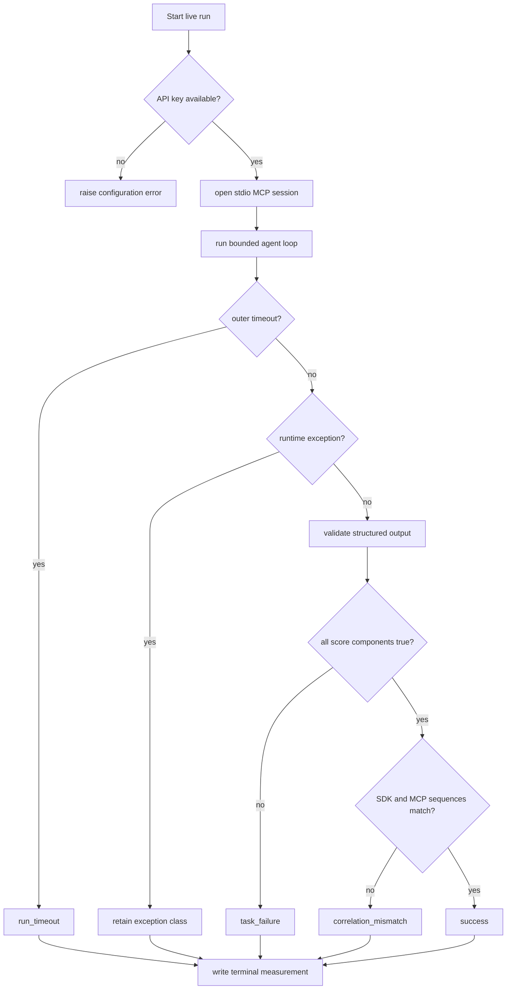

A missing credential is a precondition failure rather than a scientific agent observation. During a live run, caught provider, SDK, MCP, timeout, output-validation, task, and correlation failures are retained as terminal artifacts. The campaign continues after ordinary returned failure details; corrupt campaign infrastructure remains an abort condition.

### Campaign flow

The scientific campaign is launched explicitly:

```powershell
uv run python -m mcp_traffic_analysis.agent_campaigns incident-pilot-v2
```

It creates ten randomized complete blocks. Each block contains one run from every incident family:

$$
N_{\mathrm{run}}=N_{\mathrm{session}}=30,
\qquad n_{\mathrm{scenario}}=10.
$$

Every observation receives a fresh model run, MCP subprocess, session, and world state. Tool calls within a run are nested measurements, not independent replications.

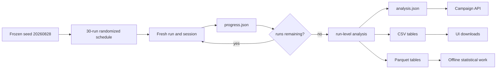

Campaign tables are separated by observational level:

| Table | One row represents |
|---|---|
| `runs` | one independent agent run/session |
| `model_calls` | one model request nested within a run |
| `mcp_calls` | one MCP tool invocation nested within a run |
| `actions` | one simulated action attempt nested within a run |
| `traces` | one run-level ordered tool sequence |

Each table is written as CSV and Parquet. `analysis.json` contains Wilson intervals for success, descriptive latency/token/byte/call summaries, scenario summaries, failure counts, rejected-action counts, first-versus-later model-call latency, unique tool sequences, modal-sequence fractions, and within-scenario normalized edit distances.

`--analyze-only` recomputes derived campaign analysis from retained run artifacts without issuing new model calls:

```powershell
uv run python -m mcp_traffic_analysis.agent_campaigns incident-pilot-v2 --analyze-only
```

### UI read path

`IncidentWorkbench` deliberately launches only one foreground run. It renders:

- task success and all five score components;
- structured diagnosis, evidence, action, target, and resolution;
- total, model, MCP RTT, nested handler, and orchestration latency;
- ordered MCP tool sequence;
- model/MCP call counts, tokens, exact frame bytes, and estimated cost;
- saved campaign success counts and `runs.csv` downloads.

The full 30-run campaign is CLI-only. This prevents a browser click from silently launching a paid repeated experiment.

### Phase 3 validation map

| Invariant | Validation path |
|---|---|
| Every scenario resets to unresolved state | Python world tests |
| Exact target is required for resolution | Python action tests |
| A prohibited attempt survives later success | Python score test |
| All ten MCP tools expose typed schemas over real `stdio` | subprocess MCP test |
| Automated agent/API tests spend no model credit | deterministic execution mode |
| SDK and MCP tool sequences agree | per-run `correlation_consistent` |
| Phase 1 and Phase 2 behavior remains intact | full Python regression suite |
| Incident result and trace render in React | Vitest component test |
| Browser can inspect a scored agent trace without credit | mocked Playwright flow |

The current validated gate is 50 Python tests, 7 React component tests, 4 Chromium end-to-end flows, Ruff, strict mypy, a production TypeScript/Vite build, lockfile verification, and `git diff --check`.
