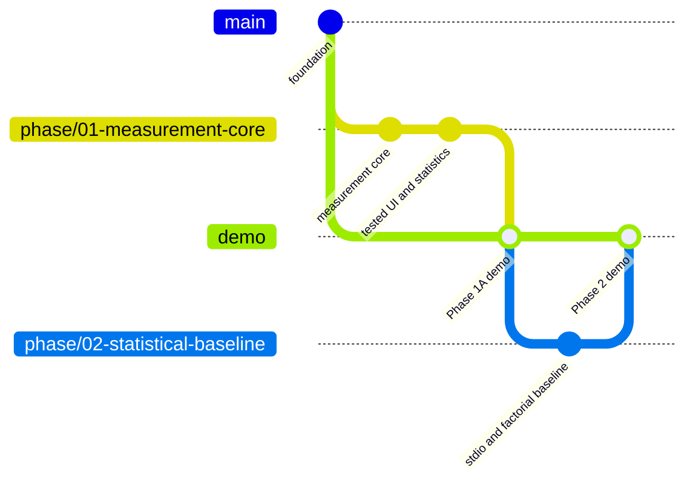
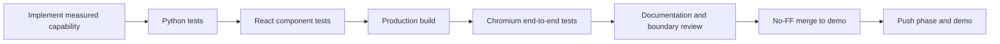

# Demo and Phase Workflow

The repository uses two kinds of long-lived evidence:

- each `phase/...` branch preserves one milestone;
- `demo` accumulates only phases that passed backend, statistical, UI, and browser tests.

`main` remains untouched until an explicit release decision.



## What the demo proves

Phase 1A provides a local React/TypeScript research workbench backed by FastAPI. A user can:

1. run any deterministic MCP scenario;
2. inspect validated run artifacts after they are persisted;
3. select one or more runs as the descriptive-analysis sample;
4. switch between call-level handler latency and run-level observed trace windows;
5. inspect summary statistics, ECDFs, reproducible histograms, box plots, timelines, and canonical events;
6. see classified failures and explicit unavailable-byte markers.

The UI does not claim that nested calls are independent, that the observed event window is total agent latency, or that in-memory Python objects reveal wire bytes.

For a field-by-field interpretation of the metrics, ECDF, histogram, box plot, grouped method table, timeline, and event stream, read [`WORKBENCH_GUIDE.md`](WORKBENCH_GUIDE.md).

## Run the workbench

```powershell
uv --cache-dir .uv-cache sync --locked --all-groups
npm install
npm run demo
```

Open `http://127.0.0.1:8000`. The production frontend is built first and served by FastAPI. Artifacts are written below `artifacts/phase1a/`.

Choose **Incident Agent** for Phase 3. A UI run uses one real hosted model and writes below `artifacts/phase3/`; every remediation remains synthetic. The full 30-run campaign stays in the CLI so a browser click cannot accidentally launch it.

For UI and API hot reload:

```powershell
npm run dev
```

The Vite UI runs at `http://127.0.0.1:5173` and proxies `/api` to FastAPI at port 8000.

## Phase 2 statistical study

Phase 2 adds a separate **Statistical study** surface. It runs a small one-condition calibration through either `in_memory` or real `stdio`, and it reads a completed 48-condition campaign. The full campaign is launched at the command line so its frozen manifest, randomized order, progress, raw artifacts, and analysis output can be inspected and resumed independently of the browser.

```powershell
uv run python -m mcp_traffic_analysis.campaigns baseline-v1 `
  --output-root artifacts/phase2 `
  --replicates 20 --calls-per-run 8 --seed 20260827 `
  --bootstrap-iterations 2000
```

This generates 960 independent runs and 7,680 nested calls. Refresh the workbench and select **Statistical study** to see campaign balance, HC3 coefficient estimates, diagnostics, run-cluster bootstrap summaries, and downloads for the `runs` and `calls` tables. Read [`phase2_statistical_baseline.md`](phase2_statistical_baseline.md) before interpreting the model output.

## Phase acceptance sequence



Playwright covers a successful repeated run, concurrent calls, controlled backend failure, artifact persistence across reload, statistics, the timeline, and the event table. Failure runs intentionally emit a FastMCP traceback in the server test log; the application records only the class-based error category, not the exception message.

## Branch commands after validation

```powershell
git push origin phase/01-measurement-core
git switch demo
git merge --no-ff phase/01-measurement-core
git push origin demo
```

For the first completed phase, create `demo` from `main` before the merge. Leave the checkout on `demo` so the immediately runnable branch is visible.
