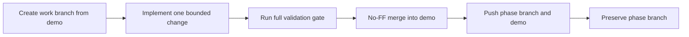

# Demo and Release Workflow

The repository has two permanent branches:

- `demo` is the tested integration branch;
- `main` is the released branch.

Each completed phase keeps its named `phase/...` branch for inspection.

## Development flow



Do not merge an untested phase branch. Do not rewrite history, delete the phase branch, or merge to `main` without explicit direction.

## Run the active demo

```powershell
uv --cache-dir .uv-cache sync --locked --all-groups
npm install
npm run demo
```

Open `http://127.0.0.1:8000`.

The default **Trace dynamics** surface explains the Phase 5 practical question using saved campaign evidence. It never launches a paid campaign.

The **Behavior study** surface runs a credit-free scripted validation. Select **Real model measurement** only when a hosted-model observation is intended.

The **Incident Agent** surface runs one live model-driven incident. All remediation remains synthetic.

For hot reload:

```powershell
npm run dev
```

The Vite UI uses port 5173 and proxies `/api` to FastAPI on port 8000.

## Acceptance gate

```powershell
uv --cache-dir .uv-cache lock --check
uv --cache-dir .uv-cache sync --locked --all-groups --check
uv --cache-dir .uv-cache run pytest -q
uv --cache-dir .uv-cache run ruff check .
uv --cache-dir .uv-cache run mypy src
npm test
npm run build
npm run test:e2e
git diff --check
```

The gate must verify measurement logic, API behavior, React components, production compilation, and all browser workflows.

## Phase integration sequence

After the full gate passes on the phase branch:

```powershell
git switch demo
git merge --no-ff phase/05-stochastic-traces
git push origin demo
git push origin phase/05-stochastic-traces
```

`main` remains unchanged until the user explicitly requests a release.
