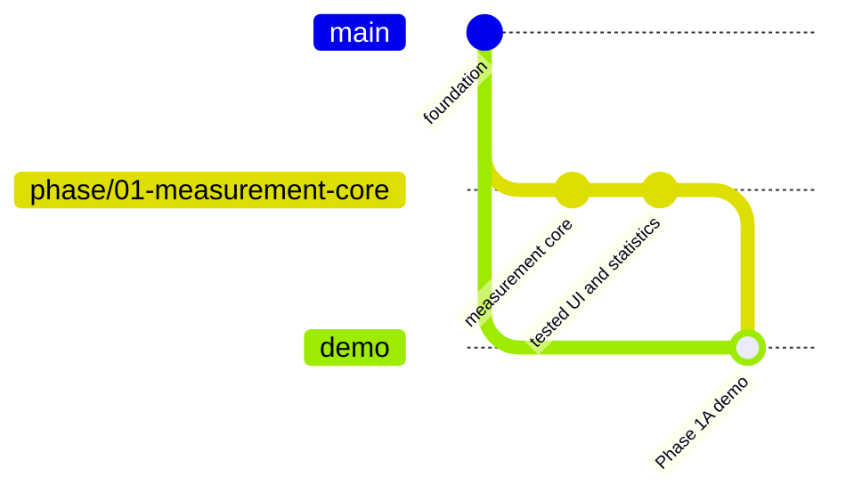
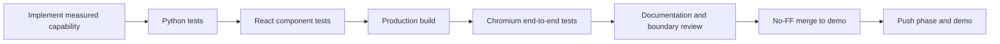

# Demo and Phase Workflow

The repository uses two kinds of long-lived evidence:

- each `phase/...` branch preserves one milestone;
- `demo` accumulates only phases that passed backend, statistical, UI, and browser tests.

`main` remains untouched until an explicit release decision.



## What the demo proves

Phase 1A provides a local React/TypeScript research workbench backed by FastAPI. A user can:

1. run any deterministic MCP scenario;
2. inspect validated run artifacts after they are persisted;
3. select one or more runs as the descriptive-analysis sample;
4. switch between call-level handler latency and run-level observed trace windows;
5. inspect summary statistics, ECDFs, reproducible histograms, box plots, timelines, and canonical events;
6. see classified failures and explicit unavailable-byte markers.

The UI does not claim that nested calls are independent, that the observed event window is total agent latency, or that in-memory Python objects reveal wire bytes.

## Run the workbench

```powershell
uv --cache-dir .uv-cache sync --locked --all-groups
npm install
npm run demo
```

Open `http://127.0.0.1:8000`. The production frontend is built first and served by FastAPI. Artifacts are written below `artifacts/phase1a/`.

For UI and API hot reload:

```powershell
npm run dev
```

The Vite UI runs at `http://127.0.0.1:5173` and proxies `/api` to FastAPI at port 8000.

## Phase acceptance sequence



Playwright covers a successful repeated run, concurrent calls, controlled backend failure, artifact persistence across reload, statistics, the timeline, and the event table. Failure runs intentionally emit a FastMCP traceback in the server test log; the application records only the class-based error category, not the exception message.

## Branch commands after validation

```powershell
git push origin phase/01-measurement-core
git switch demo
git merge --no-ff phase/01-measurement-core
git push origin demo
```

For the first completed phase, create `demo` from `main` before the merge. Leave the checkout on `demo` so the immediately runnable branch is visible.
