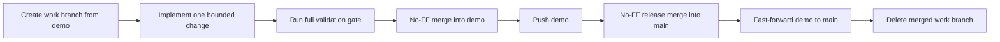

# Demo and Release Workflow

The repository has two permanent branches:

- `demo` is the tested integration branch;
- `main` is the released branch.

Work branches are temporary. They are deleted after their tested contents are released; the merge commits preserve their history.

## Development flow



Do not merge an untested work branch. Do not rewrite branch history.

## Run the active demo

```powershell
uv --cache-dir .uv-cache sync --locked --all-groups
npm install
npm run demo
```

Open `http://127.0.0.1:8000`.

The default **Behavior study** surface runs a credit-free scripted validation. Select **Real model measurement** only when a hosted-model observation is intended.

The **Incident Agent** surface runs one live model-driven incident. All remediation remains synthetic.

For hot reload:

```powershell
npm run dev
```

The Vite UI uses port 5173 and proxies `/api` to FastAPI on port 8000.

## Acceptance gate

```powershell
uv --cache-dir .uv-cache lock --check
uv --cache-dir .uv-cache sync --locked --all-groups --check
uv --cache-dir .uv-cache run pytest -q
uv --cache-dir .uv-cache run ruff check .
uv --cache-dir .uv-cache run mypy src
npm test
npm run build
npm run test:e2e
git diff --check
```

The gate must verify measurement logic, API behavior, React components, production compilation, and both browser workflows.

## Release sequence

After a clean merge into `demo`:

```powershell
git switch main
git pull --ff-only origin main
git merge --no-ff demo
git push origin main

git switch demo
git merge --ff-only main
git push origin demo
```

Delete only branches proven to be ancestors of the released `main` commit. Keep `main` and `demo` synchronized immediately after a release.
