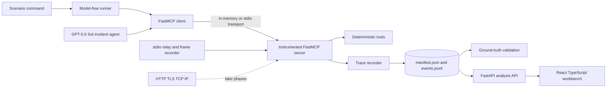

# Implementation Status

This is the living implementation record for MCP Traffic Analysis. It summarizes what is working, what has been validated, and what remains intentionally deferred.

Status date: **2026-08-27**

Active phase branch: **`phase/04-task-structure`**

Cumulative tested branch: **`demo`**

The phase branch is preserved for inspection. `main` remains unchanged until an explicit release decision.

### Phase 4 concrete task-structure study

- Three realistic synthetic incident tickets crossed with sequential, branching, and recovery task graphs.
- Nine matched conditions whose shortest successful paths all contain five MCP calls.
- Explicit oracle distance, excess calls, expected recovery rejection, path entropy, and empirical transitions.
- Frozen 27-run pilot and 90-run main randomized complete-block schedules with resume protection.
- Poisson log-mean primary call-count model with HC3 covariance and a prespecified negative-binomial sensitivity trigger.
- A React **Behavior study** surface that distinguishes scripted validation from live measurement.
- Dedicated run, call, action, trace, transition, CSV, Parquet, API, and campaign artifacts.

The implementation, credit-free validation, three live smoke runs, corrected 27-run pilot, and separate 90-run main campaign are complete. Recovery structure increased expected MCP calls by about 20.5% relative to sequential structure; branching showed no detectable call-count difference. All five failures occurred in the orders recovery condition and exposed one repeatable path-dependent mistake. The full pilot and main result are consolidated in [`results/phase4_task_structure_results.md`](results/phase4_task_structure_results.md).

## Project objective

The project studies the statistical performance of agentic AI systems through measured MCP communication. It begins with controlled application-layer traces and will later connect agent behavior to transport, network, queueing, reliability, graph, and information-theoretic properties.

The immediate methodological rule is:

> Introduce the language model only after the measurement system agrees with deterministic ground truth.

### Phase 3 measured IT-incident agent

- Three resettable incident families with known causes, evidence, correct actions, and prohibited actions.
- Ten local MCP tools for observation, simulated remediation, escalation, and updates.
- One GPT-5.6 Sol agent with low reasoning, structured output, sequential tool calls, disabled retries, and bounded execution.
- Exact stdio JSON-RPC frames, model/tool hooks, tokens, cost, latency decomposition, action ledgers, and objective scoring.
- A 30-run randomized complete-block campaign with Wilson intervals and trace-sequence variability.
- A React **Incident Agent** surface; automated tests use a credit-free deterministic path.

## Completed work

### Research foundation

- Defined the central research question and measurement quantities.
- Designed five later experimental campaigns covering task structure, autonomy, orchestration, load, and transport.
- Specified manifests, trace events, timing rules, failure taxonomy, privacy constraints, acceptance criteria, and phase exit gates.
- Documented how queueing concepts will eventually connect arrival rate, service time, waiting time, response time, utilization, and concurrency.

The complete design is in [`planning/phase1/mcp_traffic_analysis_research_protocol.md`](planning/phase1/mcp_traffic_analysis_research_protocol.md).

### Reproducible Python foundation

- Pinned Python to the 3.13 series.
- Configured uv with a committed universal lockfile.
- Separated runtime, analysis, and development dependency groups.
- Packaged the implementation under `src/mcp_traffic_analysis` with Hatchling.
- Added Ruff, strict mypy, pytest, pytest-asyncio, and Hypothesis.
- Kept Google ADK, notebooks, dashboards, databases, and packet capture out of the foundation.

### Phase 1A measurement core

- Implemented immutable, strict, schema-versioned manifests and events.
- Recorded paired UTC and monotonic timestamps.
- Added experiment, condition, run, trace, span, event, and sequence identifiers.
- Implemented append-only JSONL storage with durable flushes and overwrite protection.
- Added deterministic FastMCP tools for output, service time, and controlled failure.
- Instrumented `tools/list` and `tools/call` with server middleware.
- Classified backend exceptions, tool errors, timeouts, nonexistent tools, and cancellations.
- Added sequential, repeated, concurrent, and failure scenarios.
- Validated completed traces after every runner invocation.
- Added a 20-trial deterministic matrix within a 28-test suite.

### Phase 1A statistical workbench

- Added tested descriptive statistics for call-level latency and run-level observed trace windows.
- Defined finite/missing handling, sample standard deviation, IQR, linear quantiles, coefficient of variation, ECDFs, and deterministic histogram rules.
- Added a typed FastAPI layer for running experiments, reading validated artifacts, and analyzing selected runs.
- Added a React/TypeScript/Vite UI as the primary experiment surface.
- Added run selection, call/run unit switching, grouped method summaries, ECDFs, histograms, box plots, timelines, and canonical event inspection.
- Displayed failure classifications and explicit unavailable-byte markers.
- Added Vitest component tests and Playwright Chromium flows for success, concurrency, controlled failure, and persistence.
- Formalized the phase-to-`demo` branch workflow in `AGENTS.md` and `DEMO_WORKFLOW.md`.

### Phase 2 controlled statistical baseline

- Added a deterministic `roundtrip_payload` tool with known payload and programmed service time.
- Added a real `stdio` subprocess transport and a byte-preserving JSON-RPC relay.
- Recorded exact request and response frame sizes, direction, SHA-256 checksum, JSON-RPC identifier, and per-call correlation metadata for `stdio`.
- Defined a frozen 48-cell factorial design: transport, payload, service time, and concurrency.
- Collected a randomized 960-run / 7,680-call campaign with 20 independent run replicates per treatment cell and no failed calls.
- Wrote analysis-ready CSV and Parquet tables, an HC3 run-level OLS model, a nested call-level mixed model, and a within-condition run bootstrap.
- Added the React Statistical study, campaign API, calibration form, model diagnostics, download links, and UI/browser tests.

## Current system



Phase 1 and Phase 2 remain model-free. Phase 3 loads the ignored `.env` only at the live agent entry point; API keys are never written to artifacts or returned by the API.

## What works now

| Capability | Status |
|---|---|
| Create a reproducible experiment manifest | Implemented |
| Run deterministic MCP discovery and tool calls | Implemented |
| Correlate request start and terminal events | Implemented |
| Measure FastMCP server-handler latency | Implemented |
| Preserve concurrent spans without false serialization | Implemented |
| Distinguish five controlled failure classes | Implemented |
| Persist canonical append-only JSONL | Implemented |
| Reject invalid event combinations | Implemented |
| Validate completed trace structure | Implemented |
| Prevent payload and secret recording | Implemented |
| Run experiments through the browser | Implemented |
| Select runs and compute descriptive statistics | Implemented |
| Inspect ECDF, histogram, box plot, timeline, and events | Implemented |
| Retain UI state through persisted artifact reload | Implemented |
| Measure real stdio JSON-RPC frame bytes | Implemented |
| Run a balanced transport/payload/service/concurrency campaign | Implemented |
| Fit run-level and nested-call statistical models | Implemented |

## What is not implemented yet

| Capability | Reason deferred |
|---|---|
| Model latency, tokens, decisions, and handoffs | Added only after recorder validation. |
| Enterprise incident-response scenario system | Built after the deterministic fixture is trustworthy. |
| Queueing experiments under controlled load | Requires completed jobs and observable arrivals, service, and waiting. |
| Agent-behaviour campaign datasets and reports | Depend on a measured agent pilot and frozen task conditions. |
| HTTP, TLS, TCP, and IP measurements | Belong to later transport and networking phases. |

Null byte fields in Phase 1A are intentional. The implementation refuses to substitute Python object sizes for unobserved serialized bytes.

## Empirical observations so far

Implementation has already revealed behavior worth preserving:

1. FastMCP performs automatic `tools/list` discovery around tool activity.
2. Concurrent client calls can interleave additional discovery spans.
3. Concurrent spans do not necessarily finish in start order.
4. FastMCP wraps ordinary backend exceptions as `ToolError` while preserving the cause chain.
5. Server middleware provides method and tool semantics but not actual JSON-RPC frames.

These observations shaped the tests. The suite validates span-level causality and terminal pairing instead of asserting one oversimplified global call sequence.

## Validation evidence

The completed Phase 1A demo passed:

| Check | Result |
|---|---|
| Deterministic pytest suite | 44 passed |
| In-memory trial matrix | 20 trials represented in tests |
| Ruff | Passed |
| Strict mypy | No issues in 29 source files |
| uv lock check | Passed |
| Full-group environment synchronization | Passed |
| React component tests | 6 passed |
| TypeScript and Vite production build | Passed |
| Chromium end-to-end UI tests | 3 passed |
| Markdown and Git whitespace checks | Passed |

A repeated echo validation run produced eight events forming four spans: automatic discovery plus two successful tool calls. All byte fields were null and all events used `unavailable_transport_bypass`, matching the observation boundary.

## Run the current system

Create the locked environment:

```powershell
uv --cache-dir .uv-cache sync --locked
npm install
```

Run the primary UI:

```powershell
npm run demo
```

Open `http://127.0.0.1:8000`.

Run one scenario:

```powershell
uv --cache-dir .uv-cache run python -m mcp_traffic_analysis.fixtures.runner echo
```

Run repeated controlled service times:

```powershell
uv --cache-dir .uv-cache run python -m mcp_traffic_analysis.fixtures.runner sleep --repeat 5 --seed 42
```

Run concurrent work:

```powershell
uv --cache-dir .uv-cache run python -m mcp_traffic_analysis.fixtures.runner concurrent
```

Each command prints a unique ignored directory below `artifacts/phase1a/`. Read `manifest.json` for the condition and `events.jsonl` for the canonical event stream.

Run all validation:

```powershell
uv --cache-dir .uv-cache run pytest -q
uv --cache-dir .uv-cache run ruff check .
uv --cache-dir .uv-cache run mypy
uv --cache-dir .uv-cache lock --check
npm test
npm run build
npm run test:e2e
```

## Documentation map

- [`CODE_FLOW.md`](CODE_FLOW.md): detailed execution and data flow.
- [`phase1a_measurement_core.md`](phase1a_measurement_core.md): Phase 1A measurement boundary and usage.
- [`phase2_statistical_baseline.md`](phase2_statistical_baseline.md): Phase 2 design, boundary, artifacts, and models.
- [`results/phase2_baseline_results.md`](results/phase2_baseline_results.md): completed local result memo.
- [`planning/phase1/mcp_traffic_analysis_research_protocol.md`](planning/phase1/mcp_traffic_analysis_research_protocol.md): full research design.
- [`../README.md`](../README.md): project orientation and setup.
- [`DEMO_WORKFLOW.md`](DEMO_WORKFLOW.md): UI operation, acceptance tests, and branch workflow.
- [`WORKBENCH_GUIDE.md`](WORKBENCH_GUIDE.md): statistical interpretation of the workbench and its measurement limits.

## Roadmap


The next implementation milestone is Phase 1B: introduce a subprocess `stdio` boundary, observe actual JSON-RPC payloads and frames, correlate client and server streams, and expand deterministic validation to 200 trials. It should still use no language model.
