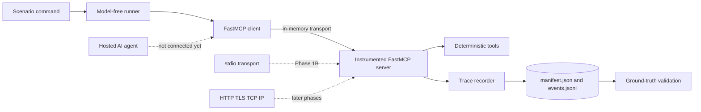

# Implementation Status

This is the living implementation record for MCP Traffic Analysis. It summarizes what is working, what has been validated, and what remains intentionally deferred.

Status date: **2026-08-27**

Current development branch: **`phase/01-measurement-core`**

Phase 1A implementation baseline: **`07a3161` (`feat: add model-free measurement core`)**

The Phase 1A implementation remains separate from `main` for inspection.

## Project objective

The project studies the statistical performance of agentic AI systems through measured MCP communication. It begins with controlled application-layer traces and will later connect agent behavior to transport, network, queueing, reliability, graph, and information-theoretic properties.

The immediate methodological rule is:

> Do not introduce a language model until the measurement system agrees with deterministic ground truth.

## Completed work

### Research foundation

- Defined the central research question and measurement quantities.
- Designed five later experimental campaigns covering task structure, autonomy, orchestration, load, and transport.
- Specified manifests, trace events, timing rules, failure taxonomy, privacy constraints, acceptance criteria, and phase exit gates.
- Documented how queueing concepts will eventually connect arrival rate, service time, waiting time, response time, utilization, and concurrency.

The complete design is in [`planning/phase1/mcp_traffic_analysis_research_protocol.md`](planning/phase1/mcp_traffic_analysis_research_protocol.md).

### Reproducible Python foundation

- Pinned Python to the 3.13 series.
- Configured uv with a committed universal lockfile.
- Separated runtime, analysis, and development dependency groups.
- Packaged the implementation under `src/mcp_traffic_analysis` with Hatchling.
- Added Ruff, strict mypy, pytest, pytest-asyncio, and Hypothesis.
- Kept Google ADK, notebooks, dashboards, databases, and packet capture out of the foundation.

### Phase 1A measurement core

- Implemented immutable, strict, schema-versioned manifests and events.
- Recorded paired UTC and monotonic timestamps.
- Added experiment, condition, run, trace, span, event, and sequence identifiers.
- Implemented append-only JSONL storage with durable flushes and overwrite protection.
- Added deterministic FastMCP tools for output, service time, and controlled failure.
- Instrumented `tools/list` and `tools/call` with server middleware.
- Classified backend exceptions, tool errors, timeouts, nonexistent tools, and cancellations.
- Added sequential, repeated, concurrent, and failure scenarios.
- Validated completed traces after every runner invocation.
- Added a 20-trial deterministic matrix within a 28-test suite.

## Current system



No hosted model is used. `.env` is ignored by Git, is not loaded by the runner, and was not read while implementing Phase 1A.

## What works now

| Capability | Status |
|---|---|
| Create a reproducible experiment manifest | Implemented |
| Run deterministic MCP discovery and tool calls | Implemented |
| Correlate request start and terminal events | Implemented |
| Measure FastMCP server-handler latency | Implemented |
| Preserve concurrent spans without false serialization | Implemented |
| Distinguish five controlled failure classes | Implemented |
| Persist canonical append-only JSONL | Implemented |
| Reject invalid event combinations | Implemented |
| Validate completed trace structure | Implemented |
| Prevent payload and secret recording | Implemented |

## What is not implemented yet

| Capability | Reason deferred |
|---|---|
| Exact JSON-RPC request and response bytes | In-memory middleware does not observe wire serialization. |
| Transport frame bytes and JSON-RPC IDs | Requires a real transport boundary. |
| Subprocess and transport overhead | Added in Phase 1B with `stdio`. |
| Model latency, tokens, decisions, and handoffs | Added only after recorder validation. |
| Enterprise incident-response scenario system | Built after the deterministic fixture is trustworthy. |
| Queueing experiments under controlled load | Requires completed jobs and observable arrivals, service, and waiting. |
| Statistical campaign datasets and reports | Depend on the agent pilot and frozen experimental conditions. |
| HTTP, TLS, TCP, and IP measurements | Belong to later transport and networking phases. |

Null byte fields in Phase 1A are intentional. The implementation refuses to substitute Python object sizes for unobserved serialized bytes.

## Empirical observations so far

Implementation has already revealed behavior worth preserving:

1. FastMCP performs automatic `tools/list` discovery around tool activity.
2. Concurrent client calls can interleave additional discovery spans.
3. Concurrent spans do not necessarily finish in start order.
4. FastMCP wraps ordinary backend exceptions as `ToolError` while preserving the cause chain.
5. Server middleware provides method and tool semantics but not actual JSON-RPC frames.

These observations shaped the tests. The suite validates span-level causality and terminal pairing instead of asserting one oversimplified global call sequence.

## Validation evidence

The Phase 1A baseline passed:

| Check | Result |
|---|---|
| Deterministic pytest suite | 28 passed |
| In-memory trial matrix | 20 trials represented in tests |
| Ruff | Passed |
| Strict mypy | No issues in 11 source files |
| uv lock check | Passed |
| Full-group environment synchronization | Passed |
| Markdown and Git whitespace checks | Passed |

A repeated echo validation run produced eight events forming four spans: automatic discovery plus two successful tool calls. All byte fields were null and all events used `unavailable_transport_bypass`, matching the observation boundary.

## Run the current system

Create the locked environment:

```powershell
uv --cache-dir .uv-cache sync --locked
```

Run one scenario:

```powershell
uv --cache-dir .uv-cache run python -m mcp_traffic_analysis.fixtures.runner echo
```

Run repeated controlled service times:

```powershell
uv --cache-dir .uv-cache run python -m mcp_traffic_analysis.fixtures.runner sleep --repeat 5 --seed 42
```

Run concurrent work:

```powershell
uv --cache-dir .uv-cache run python -m mcp_traffic_analysis.fixtures.runner concurrent
```

Each command prints a unique ignored directory below `artifacts/phase1a/`. Read `manifest.json` for the condition and `events.jsonl` for the canonical event stream.

Run all validation:

```powershell
uv --cache-dir .uv-cache run pytest -q
uv --cache-dir .uv-cache run ruff check .
uv --cache-dir .uv-cache run mypy
uv --cache-dir .uv-cache lock --check
```

## Documentation map

- [`CODE_FLOW.md`](CODE_FLOW.md): detailed execution and data flow.
- [`phase1a_measurement_core.md`](phase1a_measurement_core.md): Phase 1A measurement boundary and usage.
- [`planning/phase1/mcp_traffic_analysis_research_protocol.md`](planning/phase1/mcp_traffic_analysis_research_protocol.md): full research design.
- [`../README.md`](../README.md): project orientation and setup.

## Roadmap


The next implementation milestone is Phase 1B: introduce a subprocess `stdio` boundary, observe actual JSON-RPC payloads and frames, correlate client and server streams, and expand deterministic validation to 200 trials. It should still use no language model.
