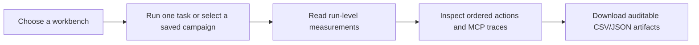

# UI Guide: What the Workbench Shows

This is the practical guide to the React workbench. The UI is a viewer for saved agent experiments. It is not a network packet monitor and it does not invent measurements that the recorder does not have.

## The overall flow



There are three tabs:

| Tab | Phase | Main purpose | Can it spend model credit? |
|---|---:|---|---|
| **Trace dynamics** | 5, 6A, 8 | Study repeated Orders-recovery traces, scalar distributions, paths, and failures | No; it reads saved campaigns |
| **Behavior study** | 4, 10 | Run or inspect task-structure experiments and compare workload by condition | A single live run can; campaigns are saved/CLI-driven |
| **Incident Agent** | 3 | Run one real agent against one synthetic incident and inspect the complete trace | Yes, when live mode is used |

## What one observation means

The basic observation is one fresh agent run and one fresh MCP session. Tool calls inside that run are nested measurements; they are not extra independent runs.

The UI displays scalar random variables first:

$$
N_r=\text{MCP calls},\quad L_r=\text{total latency},\quad T_r=\text{tokens},\quad C_r=\text{estimated cost},\quad Y_r=\text{success indicator}.
$$

It also displays the richer ordered path generated by the same run:

$$
\mathbf X_r=(X_{r1},\ldots,X_{rN_r}).
$$

The scalar values answer “how much work happened?” The path answers “what did the agent do, and in what order?”

## Trace dynamics tab

### 1. Practical question banner

The top panel states the Phase 5 question:

> After escalation is rejected, does the agent read the runbook before trying another action?

The arrows are the observable sequence:

```text
escalation rejected → read runbook or retry → success or failure
```

This is about recorded tool behaviour. It does not reveal private model reasoning.

### 2. Dataset selector

The selector chooses a saved Phase 5 campaign. The main dataset is the 100-run Orders-recovery campaign. The UI also allows the exploratory Phase 5A reanalysis to be inspected.

The campaign label tells you whether the data are exploratory or main evidence and how many valid runs are present.

### 3. Scalar Baseline (Phase 8)

This table is the first statistical view. Each row is a scalar variable summarized over runs.

| UI field | Meaning | Measurement status |
|---|---|---|
| MCP call count | Number of MCP tool calls in a run | Measured |
| Model call count | Number of model requests | Measured |
| Total latency | Time from run start to final result | Measured, client-observed |
| Model latency | Time spent inside model requests | Measured |
| MCP latency | Client-observed MCP time | Measured |
| Orchestration latency | Remaining measured orchestration time | Measured/decomposed |
| Total tokens | Input plus output model tokens | Measured from usage |
| Request frame bytes | Bytes in local stdio MCP request frames | Measured application-layer bytes |
| Response frame bytes | Bytes in local stdio MCP response frames | Measured application-layer bytes |
| Estimated cost | Cost calculated from token usage and pricing | Derived |
| Task success | Whether deterministic scoring says the task succeeded | Measured outcome |

The columns mean:

- **n**: number of valid runs contributing to the summary;
- **missing**: runs without a value;
- **mean**: arithmetic average;
- **median**: middle observed value;
- **Q1–Q3**: middle 50% of observations;
- **range**: smallest to largest observed value.

This is descriptive statistics. It tells us what happened in this campaign; it is not automatically a claim about all agents.

### 4. Batch stability

The batch table groups the 100 runs into acquisition batches. It reports success rate, runbook-first rate, mean calls, latency, and tokens.

This asks:

> Did the observed behaviour look different at different points in the campaign?

It is a drift diagnostic. It is not a time-series model and does not prove that runs are identically distributed.

### 5. Primary failure comparison

The two-by-two table compares the observable action immediately after an expected escalation rejection:

| Group | Success | Failure |
|---|---:|---:|
| Read runbook first | count | count |
| Retried first | count | count |

The displayed failure rate is

$$
\widehat P(Y=0\mid H=h),
$$

where $H$ is the observed post-rejection behaviour. The UI also shows Wilson intervals, a risk difference, a Newcombe interval, and Fisher's exact test when available.

The correct interpretation is an observed association. The agent chose the behaviour; the experiment did not randomly assign it.

### 6. Partial-history outcomes

This table asks where failure becomes visible after an observed prefix or history. It reports counts and conditional failure rates for each predefined history.

These are descriptive conditional summaries. They are not predictions from a fitted Markov model.

### 7. Tool usage

The tool table reports:

- total invocations of each tool;
- share of all tool invocations;
- number of runs that used the tool; and
- number of successful runs that used the tool.

Per-tool latency and per-tool bytes are unavailable in the current recorder. The UI says this explicitly.

### 8. Successful and failed trace lanes

The trace lanes display the ordered state sequence for one successful and one failed run. A state combines a tool with an observed outcome, for example:

```text
escalate_incident | expected_rejection
escalate_incident | accepted
```

The highlighted position is the first observable mismatch with the oracle. It is a sequence index, not a hidden chain-of-thought step.

### 9. Complete path distribution

The path chart and table show the most common complete tool-and-outcome paths. The path distribution is estimated by

$$
\widehat P(\mathbf X=x)=\frac{\#\{r:\mathbf X_r=x\}}{R}.
$$

The table is more important than entropy because it shows which concrete paths occurred. Entropy is only a compact summary of concentration:

$$
H(\mathbf X)=-\sum_xP(\mathbf X=x)\log_2P(\mathbf X=x).
$$

### 10. Transition probabilities

The transition panel counts adjacent observed movements such as

```text
inspect alert → read runbook
```

and reports row-normalized frequencies. These are observed transition summaries. The UI does not claim that the agent is a Markov chain.

### 10a. Phase 14 stochastic process

The Phase 14 panel groups the compact states into an exploratory absorbing
process. “Eventual success” means the fitted process reaches `END_SUCCESS` from
`START`; “expected steps” is the fitted average number of transitions before
termination. These are inferred from recorded paths, not directly measured
quantities. Natural-policy and assigned-policy traces are shown separately, and
holding times are marked unavailable because the current artifact has no
per-event timestamps.

### 10b. Phase 15 held-out prediction

The prediction panel compares a global-majority, current-state, and short-history
predictor. The training campaign estimates their probabilities; the separate
test campaign evaluates them. Log loss measures how much probability the model
gave to what actually happened, so lower is better. These scores are inferred
model diagnostics, not direct measurements of the agent.

### 11. Action efficiency

The efficiency panel compares successful paths with the shortest valid oracle. For a successful run,

$$
E_r=N_r-N_r^*.
$$

Failed runs do not receive a fabricated successful-path excess value.

### 12. Supporting performance measurements

This table reports focused-run medians, interquartile ranges, and observed ranges for MCP calls, total latency, tokens, local frame bytes, and estimated cost.

The latency decomposition is

$$
L_{\mathrm{total},r}=L_{\mathrm{model},r}+L_{\mathrm{MCP},r}+L_{\mathrm{orchestration},r}.
$$

Handler time is nested inside MCP time and is shown separately for explanation; it is not added again.

### 13. Divergence and acquisition diagnostics

The divergence panel compares the first oracle-divergence position for successes and failures. The batch panel compares success and runbook-first rates across acquisition batches.

Both use observable execution data only.

### 14. Raw trace and downloads

The raw-trace selector lets you inspect one focused run step by step. The artifact links download the saved CSV tables for runs, traces, paths, transitions, histories, tools, latency, divergence, and path concentration.

## Behavior study tab

### 1. Run controls

You can select:

- one of three synthetic incident tickets;
- one hidden task structure: sequential, branching, or recovery; and
- deterministic validation or one live model run.

Deterministic validation checks the oracle and scorer without model cost. It does not claim live model latency, token, or frame-byte measurements.

### 2. One-run result

After a run, the UI shows:

- task success;
- MCP calls;
- excess calls beyond the five-call oracle;
- normalized oracle distance;
- observed trace;
- shortest valid trace;
- measured boundary quantities.

### 3. Phase 10 workload analysis

This section answers:

> Does task structure change how much MCP work the agent performs?

It compares the saved 90-run campaign by structure. The primary outcome is MCP-call count; latency, tokens, cost, and success are secondary outcomes.

The model is

$$
\log(\mu_r)=\beta_0+\beta_BB_r+\beta_RR_r+\gamma_{\mathrm{incident}(r)}+\delta_{\mathrm{block}(r)}.
$$

Sequential is the reference category. Exponentiated coefficients are expected call-count ratios. The model adjusts for incident identity and randomized block.

The downloads provide the workload summaries and count-model output used by the UI.

## Incident Agent tab

This tab runs one real agent against one synthetic incident.

It shows:

- selected incident scenario;
- task-success result;
- total latency;
- model and MCP call counts;
- estimated cost;
- structured diagnosis and evidence;
- selected simulated action;
- latency decomposition;
- ordered MCP tool trace;
- token counts;
- local request/response frame bytes; and
- objective score components.

The incident is not real production infrastructure. The agent changes only an isolated JSON world state.

## What has actually been measured?

### Measured directly

- model request count;
- MCP tool-call count;
- event timestamps and elapsed durations;
- client-observed total, model, MCP, handler, and orchestration latency;
- exact newline-delimited local stdio MCP/JSON-RPC frame bytes;
- token usage when supplied by the model provider;
- ordered tools and recorded action outcomes; and
- deterministic task success and failure classification.

### Derived from measured records

- estimated model cost;
- success percentages and confidence intervals;
- empirical CDFs and histograms;
- path entropy;
- transition frequencies;
- oracle distance and first divergence;
- repeated-tool count;
- excess calls for successful runs; and
- latency component shares.

### Not measured

- TCP/IP packet sizes;
- TLS or HTTP overhead;
- Internet round-trip time;
- retransmissions or throughput;
- queue waiting time or utilization;
- controlled arrival processes;
- private model reasoning or chain of thought;
- per-tool bytes and latency; and
- production IT incidents or production reliability.

The phrase “traffic” therefore means measured MCP application traffic at the local stdio boundary, not raw network traffic.
