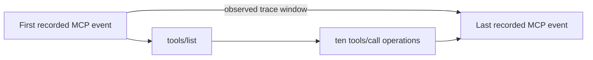

# How to Read the Statistical Workbench

This guide explains what each part of the Phase 1A UI measures. The workbench is currently a **measurement-calibration tool**, not an agent benchmark and not yet a queueing experiment.

## Phase 4 Behavior study

The **Behavior study** is the primary Phase 4 surface. It shows a concrete incoming incident ticket and crosses that ticket with one hidden structure: sequential, conditional branching, or recovery.

The left controls run one condition. **Scripted validation** follows the known oracle without model cost and must not be interpreted as a latency, token, or byte observation. **Real model measurement** records the stochastic agent, exact stdio frames, model usage, tool calls, actions, and score.

The observed path is shown beside the five-call oracle. `Excess calls` is defined only for successful runs. A recovery run's first rejected action is labeled `expected rejection`; it is part of the task rather than a reliability failure.

The saved-campaign section reports count-model effect ratios, an MCP-call ECDF, condition success and entropy, and empirical transition probabilities. A call ratio above one means more expected calls than sequential structure after accounting for task and randomized block. Entropy and transitions are descriptive and do not establish a Markov model.

Read [`phase4_task_structure.md`](phase4_task_structure.md) before interpreting a Phase 4 campaign.

## The example: 10 controlled output calls

Suppose the experiment settings are:

- scenario: `Controlled output`;
- repetitions: 10;
- seed: 42.

The scenario requests ten calls to the deterministic `echo_bytes` tool. FastMCP may also perform automatic tool discovery. A typical result therefore looks like:

| UI quantity | Example | Interpretation |
|---|---:|---|
| MCP requests | 12 | All observed MCP requests: 10 `tools/call` requests plus 2 `tools/list` discovery requests. |
| Tool calls | 10 | Only the requested `tools/call` operations. |
| Failed spans | 0 | Every observed request reached a successful terminal event. |
| Observed window | 192.24 ms | Time from the first recorded MCP event to the last recorded MCP event in this run. |

The observed window is **not** the sum of the 12 handler latencies. It can include gaps, client-side work, discovery activity, and overlapping operations. It is also not full user-to-agent response latency because Phase 1A has no model or user-facing agent loop.

## What is the statistical sample?

With **Calls** selected, one observation is one completed MCP request span. In the example:

$$
n = 12,
$$

not 10, because both `tools/list` and `tools/call` requests are included.

These 12 observations are nested inside one run. They are not 12 independent experimental replications. The summary is useful for calibration and exploration, but one run does not support population-level inference.

With **Runs** selected, one observation is one selected run's observed trace window. If only one run is selected, then (n=1). Run-level variability requires several separately executed and selected runs.

## Summary statistics

The summary card describes the currently selected unit and metric.

| Statistic | Meaning |
|---|---|
| `n` | Number of finite observations used. |
| Missing | Observations that were unavailable or non-finite and therefore excluded. |
| Mean | Arithmetic average. Sensitive to slow calls. |
| Median | 50th percentile. Half of observations are at or below this value. |
| Sample SD | Sample standard deviation using denominator (n-1). Undefined for (n<2). |
| IQR | (Q_{0.75}-Q_{0.25}), the width of the middle 50% of observations. |
| p90 | 90% of observations are at or below this interpolated value. |
| p95 | 95% of observations are at or below this interpolated value. |
| p99 | 99% of observations are at or below this interpolated value. |
| CV | Sample SD divided by the mean. It is undefined when the mean is zero. |

Quantiles use NumPy's linear interpolation convention. The example values—mean 3.70 ms and median 1.27 ms—show that a few slower requests pull the mean upward. The large CV of 1.483 similarly indicates substantial variation relative to the mean **within this small mixed sample**.

This is not yet evidence of a heavy-tailed distribution. Twelve nested observations are too few, and the sample combines two different request methods.

## Empirical CDF

The empirical cumulative distribution function is

$$
\widehat F_n(x)=\frac{1}{n}\sum_{i=1}^{n}\mathbf{1}\{X_i\le x\}.
$$

For any horizontal-axis value (x), the vertical value is the observed fraction of calls whose handler latency was at most (x). The staircase rises once per ordered observation.

Use it to answer questions such as:

> What fraction of observed requests completed within 2 ms?

Do not read it as a smooth theoretical probability distribution. It is the empirical distribution of the selected observations only.

## Reproducible histogram

The histogram groups handler latencies into intervals. Phase 1A uses the Freedman–Diaconis rule when the IQR is positive:

$$
h=2\operatorname{IQR}(X)n^{-1/3},
$$

where (h) is the target bin width. If the IQR is zero, the implementation falls back to Sturges' rule. Bin counts and edges are computed by the Python analysis layer so the UI reproduces the same result.

In the example, most observations lie near the low-latency end, while a few appear around 3 ms and 15–16 ms. With only 12 observations, the histogram is a compact visual inventory, not a density estimate suitable for tail modeling.

## Box plot and observed points

The box plot shows:

- the median;
- the middle 50% of values;
- whiskers derived by Plotly's box-plot convention;
- every individual observation as an orange point.

The high points make the mean–median difference visible. They should not automatically be deleted as “outliers.” They may be real discovery overhead or another distinct request class.

## Grouped by MCP method

The grouped table is essential because the overall distribution is a mixture:

$$
P(L\le x)=\sum_m P(L\le x\mid M=m)P(M=m),
$$

where (M) is the MCP method.

In the displayed example:

- `tools/call`: (n=10), mean 2.75 ms, median 1.27 ms;
- `tools/list`: (n=2), mean and median 8.46 ms.

This suggests that discovery calls are slower than the typical tool call in this run and help produce the right-skewed combined distribution. It is a descriptive observation, not yet a stable estimate: the discovery group has only two observations.

## Completed runs, selection, and inspection

Each row under **Completed runs** represents one persisted and validated artifact directory.

- The checkbox includes or excludes the run from the statistical sample.
- **Inspect** chooses the run whose metrics and raw event table are shown.
- Several checked runs can contribute to the analysis while only one is actively inspected.

To study run-to-run variability, execute the same scenario repeatedly as separate runs, select all matching runs, and switch from **Calls** to **Runs**.

## Timeline and event table

Further down the page, the timeline places each observed request span relative to the start of its run. It is especially useful for concurrent scenarios: overlapping bars indicate overlap in recorded execution windows, while completion order need not match start order.

The event table is the closest UI view of canonical `events.jsonl`. It shows sequence number, start/finish event kind, MCP method, tool, outcome, error classification, latency, and byte availability.

## Measurement boundary

Phase 1A observes normalized application-layer activity inside FastMCP. It measures:

- MCP method and tool identity;
- event ordering and span correlation;
- server-handler latency;
- success, failure, and error class;
- run-relative trace windows.

It does not yet measure:

- serialized JSON-RPC request or response bytes;
- transport frame sizes;
- subprocess or network latency;
- model inference time;
- queue waiting time;
- complete user-visible agent latency.

That is why byte fields say **Unavailable** instead of displaying estimates based on Python object sizes.

## What can be concluded from this first run?

The safe conclusion is:

> The recorder captured ten successful tool calls and two discovery requests, preserved their ordering and timing, and revealed that the observed method classes had different latency profiles in this calibration run.

The run does **not** establish a population latency distribution, heavy tails, queueing behavior, or agent performance. Those require repeated runs, controlled experimental conditions, and later phases with real transport and agent instrumentation.

## Incident Agent screen

**Task success** is an objective all-or-nothing score, not a model opinion. **Total latency** is user-to-result elapsed time. **Model / MCP calls** counts model decisions and tool invocations. **Estimated cost** applies the dated token prices stored in the manifest.

The decomposition separates model time, client-observed MCP tool RTT, and a residual orchestration term. Server-handler time is nested inside the MCP RTT and shown separately. Tool chips are chronological. Request and response bytes are exact newline-delimited stdio JSON-RPC frame lengths. The score panel exposes every success condition, including the permanent failure caused by a prohibited action attempt.

One run is a case study. The 30-run campaign supports descriptive variability, but ten observations per scenario do not justify strong tail or causal claims.
