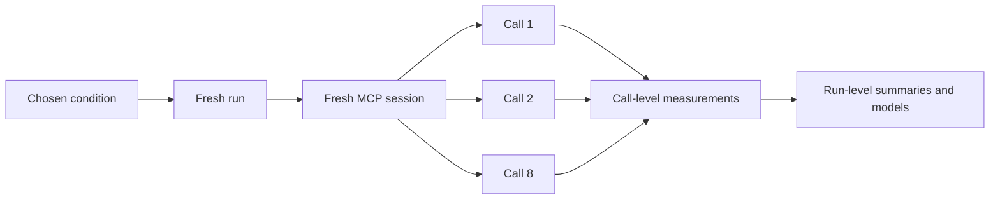
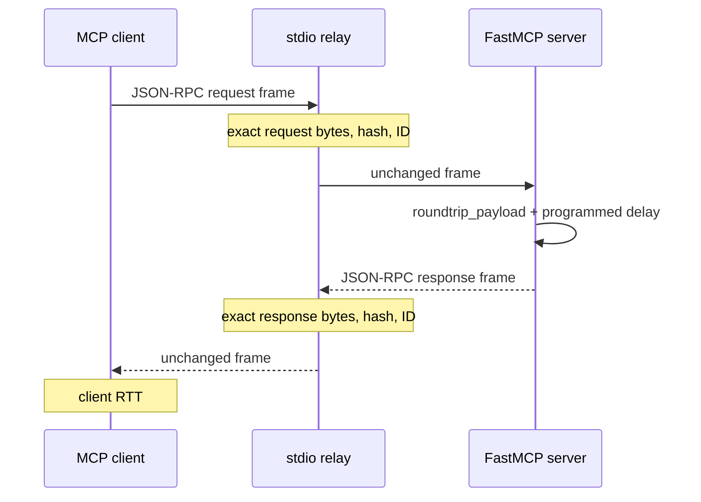

# Phase 2: controlled statistical baseline

Phase 2 is the first dataset-producing experiment in this project. It does **not** build an AI agent. It measures a small, deterministic MCP client/server system so that the statistical meaning of each observation is clear before agent decisions, model latency, retries, and real backends are introduced.

The question is deliberately narrow:

> How do transport, payload size, programmed service time, and client concurrency change the observed latency and byte volume of a controlled MCP tool call?

## Plain-language walkthrough: what we actually did

This phase is a **laboratory experiment about a very small MCP system**. We did not ask an AI model to solve tasks, and we did not benchmark a real incident-response agent. That would add too many moving parts before we know whether the measurement machinery itself is trustworthy.

Instead, we made one deterministic tool called `roundtrip_payload`. A client asks it for a specified number of harmless synthetic bytes; the server can also wait for a specified number of milliseconds before returning them. Because we choose the payload and delay ourselves, we know what changed from one experimental condition to another.

For every call, we measure the elapsed time from the client sending the request until it receives the response:

$$
L_{\mathrm{RTT}} = t_{\mathrm{response\ received}} - t_{\mathrm{request\ sent}}.
$$

We then deliberately vary four things:

| Question | What we varied |
| --- | --- |
| Does the communication boundary matter? | the client and server communicate either inside one Python process (`in_memory`) or through a separate child process (`stdio`) |
| Does message size matter? | 64 B, 1 KiB, 16 KiB, or 64 KiB returned payloads |
| Does server work matter? | an intentional 0, 20, or 100 ms delay inside the tool |
| Does simultaneous demand matter? | 1 call at a time or 4 calls at a time |

Combining those choices gives 48 conditions. We repeat each condition in 20 **fresh runs**, producing 960 runs. A run contains eight calls, so the raw dataset has 7,680 calls.

The distinction is important. The dataset has two levels:

$$
N_{\mathrm{run}}=960
\quad\text{run-level experimental units},
\qquad
N_{\mathrm{call}}=7{,}680
\quad\text{call-level measurements}.
$$

The eight calls within one run share a session and startup state. They are therefore related measurements, not eight independent replications. For the main analysis, we summarize each run by its median call latency, \(\widetilde L_r\), and use one value per run. This gives the primary model 960 experimental units instead of an artificially inflated sample size of 7,680. We call runs independent **by experimental design** because each run starts a fresh session; possible time dependence on the same machine remains a limitation to diagnose rather than something the design can guarantee away.

The main model asks how the typical latency of run \(r\) changes with transport \(T_r\), payload \(P_r\), programmed service time \(S_r\), and concurrency \(C_r\):

$$
\log\!\left(\widetilde L_r\right)
= \beta_0
+ \beta_T T_r
+ \beta_P P_r
+ \beta_S S_r
+ \beta_C C_r
+ \beta_{TP}(T_rP_r)
+ \beta_{TC}(T_rC_r)
+ \varepsilon_r.
$$

In this equation:

- \(\widetilde L_r\) is the median of the eight client-observed call latencies in run \(r\);
- \(\log\) is the natural logarithm;
- \(\beta_0\) is the expected log-latency of the reference condition;
- \(\beta_T,\beta_P,\beta_S,\beta_C\) are reference-coded factor contrasts;
- \(\beta_{TP}\) and \(\beta_{TC}\) are interaction contrasts; and
- \(\varepsilon_r\) is the part of run \(r\)'s log-latency not explained by the included factors.

The reference condition is `in_memory`, 64-byte payload, 0 ms programmed service time, and concurrency 1. Payload and service time are treated as categorical experimental factors here, so symbols such as \(\beta_P\) represent several contrasts against a reference level, not one continuous slope.

The two interaction terms ask questions that main effects cannot answer alone:

- \(\beta_{TP}\): does the effect of payload size differ between `in_memory` and `stdio`?
- \(\beta_{TC}\): does the effect of concurrency differ between `in_memory` and `stdio`?

We use a logarithm because latency is positive and comparisons such as “twice as long” are usually more meaningful than fixed additive differences. After fitting the model, exponentiating a coefficient gives a conditional latency ratio. For example, if a coefficient were \(\log 2\), the associated contrast would correspond to \(e^{\log 2}=2\): twice the typical latency, holding the other modeled factors fixed. We fit this run-level equation by ordinary least squares and use HC3 heteroskedasticity-robust standard errors for its coefficient intervals.

Finally, `stdio` is not an Internet connection. It is a local subprocess boundary. We record genuine serialized JSON-RPC frames there—request and response bytes, line endings, hashes, and protocol IDs—but we do not record TCP/IP packets, Internet round-trip time, or a production queue. Phase 2 is therefore a calibrated starting point: it tests the measurement and statistical workflow before we use it on agent behaviour or queueing experiments.

## What one observation means

One **run** is the independent experimental unit. A run creates a fresh MCP client/server session under one fixed treatment combination and makes eight calls to `roundtrip_payload`.

One **call** is a nested observation within that run. Calls are useful for inspecting within-run variation, but they must not be treated as eight independent replications.



The tool returns a deterministic ASCII payload of the requested size after an optional, programmed delay. There is no model inference, no external API, no database, and no hidden workload.

## Experimental design

The baseline is a balanced factorial experiment:

| Factor | Levels |
| --- | --- |
| MCP transport | `in_memory`, `stdio` |
| Target payload bytes | 64, 1,024, 16,384, 65,536 |
| Programmed server service time | 0, 20, 100 ms |
| Client concurrency | 1, 4 |
| Independent run replicates per cell | 20 |
| Calls per run | 8 |

There are

$$
2 \times 4 \times 3 \times 2 = 48
$$

treatment cells, giving

$$
48 \times 20 = 960 \text{ runs},
\qquad
960 \times 8 = 7{,}680 \text{ calls}.
$$

Runs are randomly ordered inside each of 20 complete replicate blocks, using seed `20260827`. This prevents a simple time trend from always being confounded with a particular factor level. The frozen `manifest.json` records every planned run before collection begins.

## Measurement boundary

The outcome is the client-observed round-trip time

$$
L_{\mathrm{RTT}} = t_{\mathrm{client\ receives\ response}} - t_{\mathrm{client\ sends\ request}}.
$$

For each call we also preserve the server handler duration,

$$
L_{\mathrm{handler}},
$$

so the residual

$$
L_{\mathrm{nonhandler}} = L_{\mathrm{RTT}} - L_{\mathrm{handler}}
$$

is an observed remainder. It includes serialization, scheduling, protocol processing, and client-side effects; it is **not** automatically a network delay or queueing delay.

`in_memory` measures application/handler behaviour but deliberately leaves byte fields unavailable. It does not cross a serialized wire boundary.

`stdio` starts a separate FastMCP server process. A relay copies every newline-delimited JSON-RPC frame unchanged between the client and child process. It records the actual payload and frame byte counts (including the line delimiter), SHA-256 checksum, direction, JSON-RPC identifier, and correlated call identifier. This is application/protocol-frame measurement, not an IP packet capture.



## Analysis plan

The primary response is each run's median call RTT, analyzed on the log scale:

$$
\log\!\left(\widetilde L_{r}\right)
= \beta_0
+ \beta_T T_r
+ \beta_P P_r
+ \beta_S S_r
+ \beta_C C_r
+ \beta_{TP}(T_r P_r)
+ \beta_{TC}(T_r C_r)
+ \varepsilon_r.
$$

This is ordinary least squares with HC3 heteroskedasticity-robust standard errors. It is a controlled descriptive/explanatory model, not a claim about a population of arbitrary MCP servers.

The call-level secondary model accounts for calls being nested within runs:

$$
\log(L_{rj}) = X_r\beta + \gamma\,\mathrm{first}_{rj} + b_r + \epsilon_{rj},
\qquad b_r \sim \mathcal N(0, \tau^2).
$$

The random intercept (b_r) represents persistent run-to-run differences. The reported intra-class correlation is

$$
\mathrm{ICC} = \frac{\tau^2}{\tau^2 + \sigma^2}.
$$

For `stdio` runs, a separate byte model uses the run median of total request-plus-response frame bytes. Condition-level uncertainty is summarized by a bootstrap that resamples **runs within treatment cells**, never individual calls.

The workbench provides the model coefficients with HC3 intervals, residual-versus-fitted and QQ diagnostics, empirical summaries, and downloadable `runs` and `calls` tables. Treat diagnostics as checks on the model's usefulness, not as an automatic proof that a model is correct.

## Artifacts and reproducibility

Run the frozen baseline from the command line:

```powershell
uv run python -m mcp_traffic_analysis.campaigns baseline-v1 `
  --output-root artifacts/phase2 `
  --replicates 20 --calls-per-run 8 --seed 20260827 `
  --bootstrap-iterations 2000
```

The campaign writes ignored artifacts under `artifacts/phase2/baseline-v1/`:

- `manifest.json`: frozen treatment schedule and analysis specification;
- `progress.json`: resumable collection state;
- `tables/runs.csv` / `tables/runs.parquet`: one row per independent run;
- `tables/calls.csv` / `tables/calls.parquet`: one row per nested call;
- `analysis.json`: model outputs, diagnostics, and bootstrap summaries;
- `runs/<run_id>/`: original event, frame, call, and server-stderr artifacts.

The UI is intentionally a reader of these saved artifacts. It can run a small one-condition calibration trial, but the full campaign is launched by the reproducible command above. This keeps the scientific protocol separate from the convenience interface.

## What Phase 2 does and does not establish

It establishes a validated baseline for how known factors affect measurements in one local implementation and one machine. It also validates the trace/byte recording pipeline that later phases will rely on.

It does **not** measure Internet network packets, production queues, model inference, agent autonomy, tool selection, external backend behavior, or general MCP performance. Those are later hypotheses. Queueing theory becomes useful once we introduce controlled offered load and a resource whose queue is measured; it should not be retrofitted onto these local residuals.
