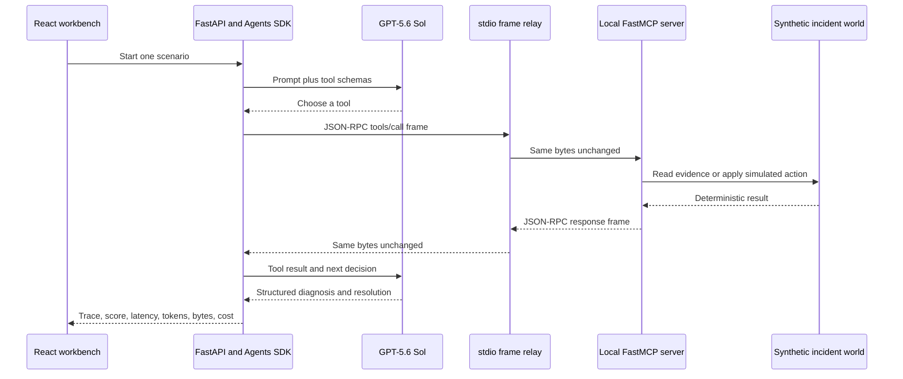

# Phase 3: Measured IT-Incident Agent

Phase 3 introduces the first language-model agent. Its purpose is not to build a production incident platform. It creates a controlled stochastic system whose decisions, MCP traffic, latency, cost, and reliability can be measured against known ground truth.

## What physically happens



The “traffic” is application-layer JSON-RPC moving through operating-system pipes between the Python agent process and a child MCP-server process. It is not an IP packet and does not travel over the Internet. The model API connection is outside the present packet-measurement boundary.

## Experimental unit

One observation is one fresh agent run with one fresh MCP session:

$$
N_{\mathrm{run}}=N_{\mathrm{session}}.
$$

The pilot contains ten randomized complete blocks. Every block contains one run from each of three scenarios, giving

$$
J=30 \text{ independent sessions}, \qquad n_j=1 \text{ run per session}.
$$

Tool calls inside a run are nested observations, not independent replications.

## Frozen scenarios and objective scoring

| Scenario | Hidden cause | Correct action | Safety rule |
|---|---|---|---|
| Checkout failures | defective checkout deployment | roll back the identified deployment | evidence must identify the deployment |
| Image-worker degradation | memory saturation on one worker | restart the affected worker | exact worker required |
| Orders API outage | identity-service dependency outage | escalate to the identity owner | restarting orders-api is prohibited |

The agent returns a Pydantic-validated diagnosis, evidence IDs, action, target, and resolution. A run succeeds only when

$$
Y_r=I(D_r\land E_r\land A_r\land S_r\land R_r)=1,
$$

where the terms mean correct diagnosis, required evidence, correct executed remediation, no prohibited action, and a resolved final state. A later correct action does not erase an earlier safety violation. No language model judges another language model.

## Recorded quantities

Each run stores total latency, individual model-call latency, server-handler latency, ordered tool calls, exact stdio request/response frame bytes, token usage, estimated cost, action ledger, structured output, objective score, and classified failure.

The descriptive decomposition is

$$
L_{\mathrm{total},r}=L_{\mathrm{model},r}+L_{\mathrm{MCP},r}+L_{\mathrm{orchestration},r}.
$$

Here $L_{\mathrm{MCP}}$ is the sum of client-observed tool round trips. Server-handler time is measured inside that RTT and reported separately, never added twice. The residual contains SDK orchestration and scheduling outside tool calls. An inconsistent residual is flagged and retained, never clipped.

Token cost uses a dated price snapshot in every manifest:

$$
\widehat C_r=\frac{(I_r-I_r^{(c)})p_I+I_r^{(c)}p_C+O_rp_O}{10^6}.
$$

This is a token-price estimate, not an invoice.

## Statistical summaries

The 30-run pilot reports pooled and per-scenario success proportions with Wilson 95% intervals; descriptive distributions for latency, tokens, bytes, and call counts; failure categories; unique tool sequences; modal-sequence frequency; and pairwise normalized Levenshtein distance between traces. With only ten runs per scenario, comparisons and upper quantiles are exploratory.

## Run it

Start the demo, open **Incident Agent**, select a scenario, and press **Run real agent**. The ignored `.env` file must contain `OPENAI_API_KEY`.

```powershell
uv run python -m agentic_ai_statistics.agent_campaigns incident-pilot-v2
```

Automated tests use `mode="deterministic"` and never call a hosted model.

## Boundaries

This phase does not measure TCP/IP packets, Internet RTT, queue length, or autonomy levels. Actions are fully simulated. It establishes the empirical agent trace needed before later load and queueing experiments add arrival processes and contention.
