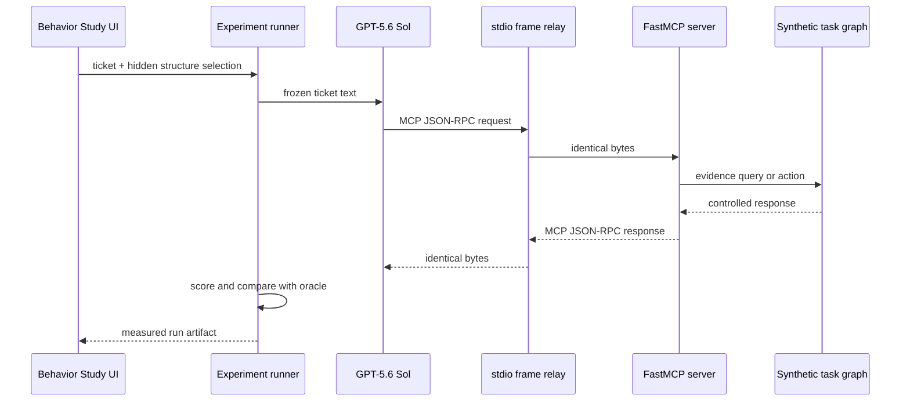

# Phase 4: What the Behavior Study Does

## The simple explanation

We give the same real AI agent a realistic but synthetic incident ticket. The agent must use MCP tools to investigate and resolve it.

The visible ticket stays the same, but the hidden task mechanics change:

- one version leads the agent through evidence in sequence;
- one version requires the agent to choose an evidence branch;
- one version deliberately rejects the first safe action and requires recovery.

We repeat each condition because a language-model agent is stochastic. Two runs can receive the same ticket and still call different tools, repeat different actions, take different amounts of time, or spend different numbers of tokens.

Phase 4 therefore studies a distribution of agent traces rather than treating one attractive demo as evidence.

## Study status and answer

The corrected 27-run pilot and separate 90-run main campaign are complete. In the main study, recovery structure increased expected MCP calls by about 20.5% relative to sequential structure. Branching did not show a detectable call-count difference. Overall success was 85/90, with all five failures concentrated in the orders recovery condition.

The complete statistical interpretation and reproducibility record are in [`results/phase4_task_structure_main_results.md`](results/phase4_task_structure_main_results.md).

## The three tickets

| Ticket | Hidden cause | Correct final action |
|---|---|---|
| Checkout failures after release | defective checkout deployment | roll back the identified deployment |
| Image-processing backlog | memory saturation on `image-worker-3` | restart `image-worker-3` |
| Orders API 503 responses | `identity-service` outage | escalate to `identity-service-owner` |

The Orders API must never be restarted. All actions change only an isolated JSON state file.

## What is genuinely measured?

A live run crosses the existing local stdio MCP boundary:



Live mode measures model calls, MCP calls, exact stdio frame bytes, latency, tokens, cost, action outcomes, and terminal success.

Deterministic mode executes the known oracle directly. It validates task structure and scoring without using a model. Its UI explicitly marks latency, tokens, and stdio bytes as unavailable rather than pretending that scripted values are measurements.

## Why every oracle has five calls

If branching had seven necessary calls while sequential had three, a higher call count would be guaranteed by task length. That would not cleanly isolate structure.

All nine conditions therefore have a five-call shortest valid trace. A successful run that uses eight calls has

$$
N_{\mathrm{excess}}=8-5=3.
$$

Failures retain their observed call count, but excess calls are left undefined because the run never completed a valid path.

## How to run one task

```powershell
npm run demo
```

Open `http://127.0.0.1:8000` and select **Behavior study**. Start with **Scripted validation**. It costs nothing and makes the oracle visible. Select **Real model measurement** only when you want a stochastic hosted-model observation.

## Campaign commands

Credit-free campaign validation:

```powershell
uv --cache-dir .uv-cache run --all-groups python -m mcp_traffic_analysis.behavior.campaigns `
  task-structure-pilot-check --stage pilot --mode deterministic
```

Paid pilot:

```powershell
uv --cache-dir .uv-cache run --all-groups python -m mcp_traffic_analysis.behavior.campaigns `
  task-structure-pilot-v1 --stage pilot
```

Paid main study, only after the pilot protocol is frozen:

```powershell
uv --cache-dir .uv-cache run --all-groups python -m mcp_traffic_analysis.behavior.campaigns `
  task-structure-main-v1 --stage main
```

Use `--resume` after an interruption. Use `--analyze-only` to rebuild tables and models without issuing model calls.

## How to read the UI

- **MCP calls** is the observed amount of tool work.
- **Excess calls** compares a successful run with the five-call oracle.
- **Oracle distance** is zero for an exact path and increases as calls are inserted, removed, or substituted.
- **Expected rejection** is the planned recovery event.
- **Unexpected rejection** is an action that was neither accepted nor part of the recovery design.
- **Call ratio** compares branching or recovery with sequential after accounting for ticket and randomized block.
- **Path entropy** describes diversity of complete observed sequences.
- **Transition probability** is an empirical summary of adjacent tool calls, not a fitted Markov model.

## Limits

The three tasks are fixed synthetic examples. Scenario terms control their differences, but they are not a random sample of every possible IT problem. Hosted-model timing may also drift over time; randomized blocks reduce, but do not eliminate, that concern.

This phase does not measure queue waiting, arrival processes, utilization, HTTP/TLS/TCP/IP behavior, or production reliability.

The primary count analysis uses a Poisson log-mean model with HC3 robust covariance. “Poisson” specifies the mean link used to estimate call ratios; the robust covariance avoids assuming that the empirical call-count variance must equal its mean. A negative-binomial sensitivity fit is attempted only when Pearson dispersion exceeds 1.25.
