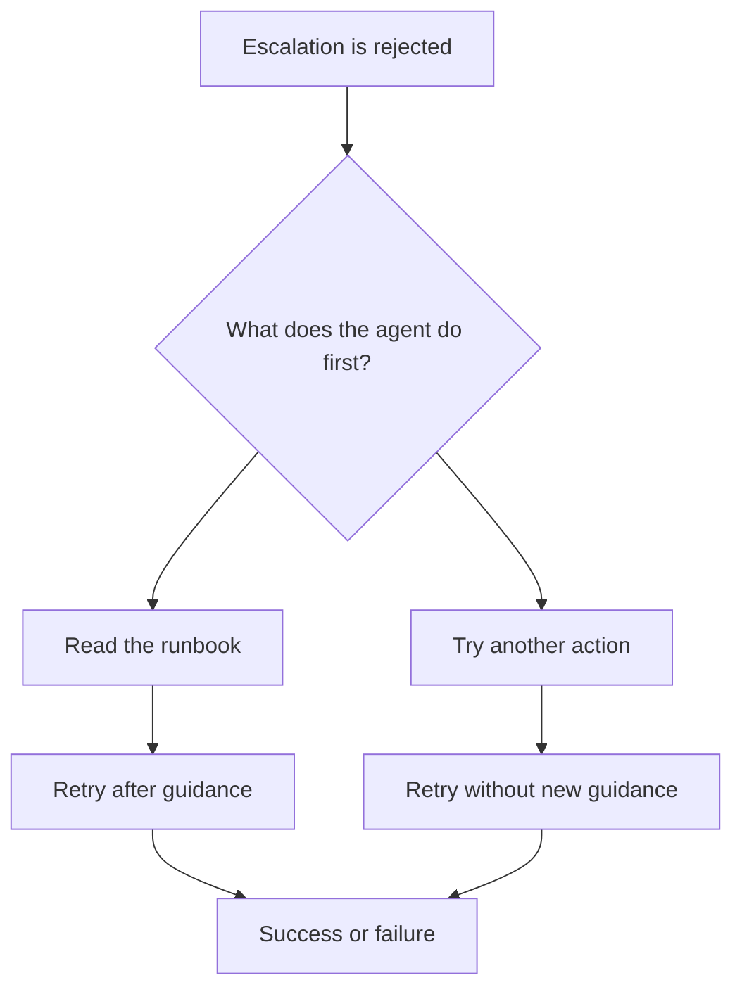

# Phase 5: Stochastic Traces in Plain Language

## What are we doing?

We give the same agent the same synthetic Orders API incident many times. The environment, prompt, model, tools, and transport stay fixed. What can change is the path chosen by the model.

The important moment occurs after the correct escalation is deliberately rejected:



The first statistical question is simply: among runs in each branch, what fraction failed?

## From an incident to a table

For every run, the software records the ordered MCP tools and joins action tools to the synthetic world's action ledger. A state contains both pieces:

```text
escalate_incident | expected_rejection
get_runbook       | observed
escalate_incident | accepted
END_SUCCESS
```

This makes the practical comparison auditable:

| First relevant behaviour after rejection | Success | Failure |
|---|---:|---:|
| Read runbook | counted from runs | counted from runs |
| Try another action | counted from runs | counted from runs |

If $F_r$ records failure and $H_r$ records reading the runbook first, we compare

$$
P(F_r=1\mid H_r=1)
\quad\text{with}\quad
P(F_r=1\mid H_r=0).
$$

Confidence intervals show how imprecise these percentages are. The observed behaviour was not randomized, so the comparison is an association, not a general causal estimate.

## The other two questions

The complete ordered path answers whether the agent behaves consistently. We count each distinct path and report its observed percentage. Entropy compresses this distribution into one number, but the UI always shows path counts first.

The five-call oracle answers how much additional work successful runs perform:

$$
E_r=N_r-5.
$$

Failed runs do not receive a successful-path excess value because they never completed the valid path.

## Data stages

- **Stage 5A** reuses the 90 Phase 4 runs and costs no model credit. Its ten Orders-recovery observations are pilot evidence.
- **Stage 5B** collects 100 new Orders-recovery runs under a frozen configuration. Collection is currently paused at 66 valid runs after provider quota exhaustion. Provider failures are audited but never counted as agent outcomes.

The UI labels these stages rather than silently combining them.

## What this phase does not claim

Phase 5 does not reveal private model reasoning, establish a Markov chain, create network load, measure queue waiting, or observe HTTP/TLS/TCP/IP packets. It studies the empirical distribution of application-level agent traces in one controlled synthetic task.
