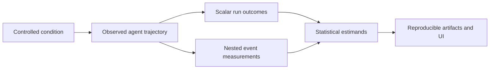

# Phase 12: Statistical Study Layer

Status: Phase 12A specification complete; Phase 12B scalar implementation in progress; no new model calls

## Purpose

Observability tells us what happened during one execution. This project uses those measurements to study what happens across repeated executions. Phase 12 makes that distinction explicit and turns it into an auditable, transport-neutral study protocol.

The primary experimental unit remains one fresh agent run. Tool calls are nested measurements, not independent repetitions.

## Scientific questions

The question registry is the source of truth. Questions are answered in this order:

1. **Scalars first:** What are the distributions of calls, latency, tokens, cost, and success?
2. **Comparisons:** Do controlled task conditions change those distributions?
3. **Trajectories:** What is the empirical distribution of complete variable-length paths?
4. **Histories:** Which observable histories are associated with failure?
5. **Stability:** Do outcomes change across acquisition order or batches?
6. **Interventions:** What changes when a behavior is deliberately assigned?
7. **Process models:** Only after diagnostics, does a Markov or richer stochastic model adequately describe paths?

Every question must name an estimand, data unit, source artifact, uncertainty method, and interpretation limit.

## Framework boundary

MCP is the first adapter, not the scientific definition of the framework. The reusable study object is a run containing conditions, ordered events, scalar outcomes, and measurement-status metadata. Future adapters may represent HTTP or another tool protocol without changing the statistical questions.

## Deliverables

- `docs/specs/statistical_analysis_spec.md`: random objects, analysis levels, and scientific limits.
- `docs/specs/analysis_questions.yaml`: registered questions Q01–Q15.
- `docs/specs/data_dictionary.md`: field types, levels, units, and measurement status.
- `docs/specs/analysis_contracts.md`: input/output and interpretation contract for every question family.
- `docs/specs/analysis_traceability.md`: question-to-artifact-to-UI mapping.

## Acceptance criteria

- A reader can identify the experimental unit and denominator for every result.
- Scalar variables are reported before path summaries.
- Nested calls are never presented as independent runs.
- Measured, derived, inferred, and unavailable quantities are distinct.
- Observational associations are not described as causal effects.
- Existing saved Phase 4 and Phase 5 data are sufficient for the first implementation stages.
- No new model calls are required for this phase.

## Later implementation stages

Phase 12A defined the contracts. Phase 12B implements saved-data scalar analyses, Phase 12C implements trajectory analyses, and Phase 12D designs a small randomized intervention. A stochastic-process model is deferred until path-dependence diagnostics justify one.
