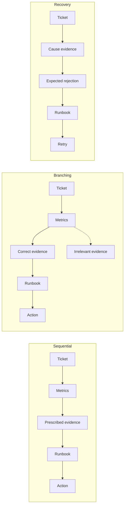

# Phase 4 Plan: Concrete Tasks and Stochastic Agent Traces

## Question

> When the same agent handles a concrete IT incident, how does the hidden structure of the task change MCP calls, action efficiency, reliability, latency, cost, and execution-path variability?

The primary outcome is the number of MCP calls in one complete run, $N_{\mathrm{MCP},r}$. Success, latency, bytes, tokens, cost, failures, and trace variability are secondary outcomes.

## Concrete tasks

The agent receives one of three simulated incoming incident tickets:

1. Checkout started failing after a production release.
2. Image uploads are accumulating and processing exceeds its SLO.
3. The Orders API returns 503 responses.

The text is held fixed across task structures. The application does not read Outlook, contact users, or modify production infrastructure.

## Experimental factor

Each ticket is implemented as three hidden task graphs:

- **Sequential:** the world supplies a prescribed evidence order.
- **Branching:** a metric determines which evidence source is relevant.
- **Recovery:** a correct safe action is rejected once and must be retried after consulting guidance.

Every shortest successful path contains exactly five MCP calls. This prevents path length from being an accidental explanation for structure effects.

## Sample size and randomization

There are nine conditions:

$$
3\ \text{tasks}\times3\ \text{structures}=9.
$$

The pilot contains three randomized complete blocks:

$$
N_{\mathrm{pilot}}=9\times3=27.
$$

The main study contains ten separate randomized complete blocks:

$$
N_{\mathrm{main}}=9\times10=90.
$$

Each block contains all nine conditions once. Pilot observations are never included in the main analysis. One fresh run and MCP session is the experimental unit.

## Primary model

For run $r$:

$$
\operatorname{E}(N_{\mathrm{MCP},r}\mid X_r)=\mu_r,
$$

$$
\log(\mu_r)=
\beta_0+
\beta_B I(\text{branching}_r)+
\beta_R I(\text{recovery}_r)+
\gamma_{\text{task}(r)}+
\delta_{\text{block}(r)}.
$$

Sequential is the reference structure. The quantities $\exp(\beta_B)$ and $\exp(\beta_R)$ are MCP-call ratios. The primary estimator is a Poisson log-mean GLM with HC3 robust covariance, so uncertainty does not rely on equality of the conditional mean and variance. The pilot showed underdispersion. A negative-binomial sensitivity model is fitted only if the main-study Pearson dispersion estimate exceeds the frozen threshold 1.25.

For successful runs:

$$
N_{\mathrm{excess},r}=N_{\mathrm{MCP},r}-5.
$$

An expected recovery rejection is part of the five-call oracle and is not counted as poor behavior.

## Trace analysis

The observed ordered tool sequence is compared with the condition's oracle:

$$
D_{\mathrm{oracle},r}=
\frac{d_{\mathrm{edit}}(\text{observed}_r,\text{oracle}_r)}
{\max(N_{\mathrm{observed},r},N_{\mathrm{oracle},r})}.
$$

The study also reports unique paths, modal-path frequency, repeated calls, empirical transition probabilities, and path entropy:

$$
\widehat H=-\sum_k p_k\log_2(p_k).
$$

Transition probabilities and entropy are descriptive. They are not evidence that the agent follows a Markov process.

## Delivery gates

1. Validate all nine oracle paths without model cost.
2. Test task gating, scoring, recovery, trace metrics, schedule balance, resumability, API, UI, and browser flow.
3. Run one paid smoke test per structure.
4. Collect and inspect the 27-run pilot.
5. Freeze the protocol; if it changes, use a new pilot identifier.
6. Collect the separate 90-run main study.
7. Publish the methods, limitations, and result memo.
8. Merge the tested phase branch into `demo` with `--no-ff`; do not merge to `main`.

Out of scope are prompt variants, autonomy levels, multi-agent systems, queueing, HTTP MCP, packet capture, and claims about all IT incidents.
