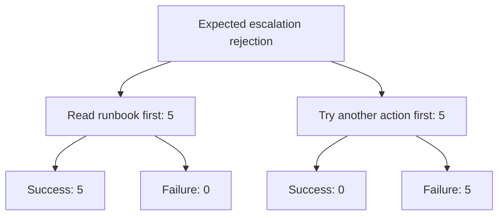

# Phase 5 Results: Stochastic Trace and Failure Paths

## What question are we answering?

The agent repeatedly receives the same synthetic Orders API incident. After its escalation is deliberately rejected, it must either read the runbook before trying another action or try another action first.

The practical question is:

> How often does each behaviour occur, and what failure percentage follows it?

This document is the single results record for Phase 5. Stage 5A is complete. Stage 5B is currently interrupted after 66 of 100 valid runs, so its numbers are reported as interim diagnostics rather than final confirmatory results.

## Stage 5A: existing 90-run dataset

Stage 5A reanalysed the complete Phase 4 main campaign:

$$
N_{\mathrm{all}}=90,
\qquad
N_{\mathrm{Orders,recovery}}=10.
$$

No new model calls were made. The focused ten runs are pilot evidence and are not the Phase 5 main sample.

## Practical result

| First behaviour after expected escalation rejection | Success | Failure | Failure percentage |
|---|---:|---:|---:|
| Read runbook first | 5 | 0 | 0% |
| Tried another action first | 0 | 5 | 100% |

Let $H_r=1$ mean that the runbook was read before another action and let $F_r=1$ mean failure. The observed pilot estimates were

$$
\widehat P(F_r=1\mid H_r=1)=0,
$$

and

$$
\widehat P(F_r=1\mid H_r=0)=1.
$$

The estimated failure-risk difference, retry-first minus read-first, was

$$
\widehat\Delta=1.00.
$$

Its Newcombe 95% interval was

$$
[0.386,1.000].
$$

The Wilson intervals for the individual failure percentages were 0% to 43.4% for read-first and 56.6% to 100% for retry-first. Fisher's two-sided exact $p$-value was 0.00794.

The counts are striking, but each category contains only five runs. The wide intervals are the reason for collecting a separate 100-run main dataset.

## What did the traces look like?



The ten focused runs produced eight distinct complete tool-and-outcome paths. Seven paths occurred once. The most common path occurred three times. Plug-in path entropy was 2.846 bits, with a run-level bootstrap interval of 1.571 to 2.722 bits. The bootstrap interval is descriptive and can be biased downward with many previously unseen paths.

Among the five successful runs, excess calls relative to the five-call oracle had:

| Quantity | Calls |
|---|---:|
| Mean | 5.2 |
| Median | 5 |
| Interquartile range | 5 to 5 |
| Observed range | 5 to 6 |

No successful focused run exactly followed the five-call oracle. Extra investigation is not automatically useless, but it is additional MCP work.

## Variable definitions

| Variable | Type | Observed Stage 5A focused values |
|---|---|---|
| Runbook-first indicator $H_r$ | Binary | 0 or 1; five runs at each value |
| Failure indicator $F_r$ | Binary | 0 or 1; five runs at each value |
| Complete state path $X_r$ | Ordered categorical sequence | Eight observed paths |
| MCP-call count $N_r$ | Discrete count | Recorded per run |
| Successful-run excess $E_r$ | Discrete count or undefined | 5 to 6 among successes |
| Oracle distance | Continuous ratio in $[0,1]$ | Recorded per run |
| Batch | Categorical acquisition block | Phase 4 blocks 1 through 10 |

## Interpretation

Within this synthetic world, rereading the runbook changes the world state that gates the next escalation. The result therefore has a clear system mechanism. The agent's choice to reread was not randomized, however, so this is an observed behaviour-outcome association rather than a general causal effect for production agents.

The data show that complete traces contain information hidden by final-answer success alone. They do not reveal private model reasoning or establish that traces follow a Markov chain.

## Stage 5B: incomplete main campaign

The frozen main campaign targets 100 new Orders-recovery runs in ten batches of ten. The historical ten-run pilot and the separate three-run smoke campaign are not part of this sample.

Collection stopped because the model provider returned `RateLimitError` with `insufficient_quota`. The scientifically usable prefix is

$$
N_{\mathrm{valid}}=66
\quad\text{of the planned}\quad
N_{\mathrm{planned}}=100.
$$

Seventeen provider-error attempts are retained for operational audit but excluded from every scientific count, percentage, path, transition, and interval. One additional execution directory was interrupted before a `detail.json` record existed and is also excluded. The campaign is resumable from execution order 67 after model credit becomes available.

### Interim practical table

| First behaviour after expected escalation rejection | Success | Failure | Failure percentage |
|---|---:|---:|---:|
| Read runbook first | 44 | 0 | 0% |
| Tried another action first | 0 | 22 | 100% |

For this incomplete valid prefix,

$$
\widehat P(F_r=1\mid H_r=1)=0,
\qquad
\widehat P(F_r=1\mid H_r=0)=1,
$$

and the observed risk difference is

$$
\widehat\Delta=1.00.
$$

The Newcombe 95% interval for the risk difference is $[0.831,1.000]$. The Wilson 95% intervals for the individual failure percentages are 0% to 8.0% for runbook-first and 85.1% to 100% for retry-first. Fisher's two-sided exact $p$-value is approximately $5.32\times10^{-15}$.

These calculations describe the 66 collected runs; they are not the preplanned final analysis. The agent's branch choice was also observed rather than randomized, so the result remains an association within this synthetic incident.

### Interim path and performance summaries

The 66 valid runs produced 18 distinct complete state paths. Ten paths occurred once. The modal path occurred 34 times, or 51.5% of valid runs. Plug-in path entropy was 2.768 bits, with a run-level bootstrap interval of 2.007 to 3.011 bits.

Among the 44 successful runs, the agent made a median of five calls beyond the five-call oracle; the observed excess ranged from four to six calls. No successful run exactly followed the oracle.

| Measured quantity per valid run | Median | Q1 to Q3 | Observed range |
|---|---:|---:|---:|
| MCP calls | 10 | 9.25 to 10 | 9 to 11 |
| Total agent runtime | 20.00 s | 18.81 to 21.41 s | 17.16 to 24.38 s |
| Model tokens | 10,430 | 9,732 to 10,493 | 8,961 to 12,185 |
| Exact MCP request-frame bytes | 1,835 | 1,743 to 1,854 | 1,675 to 2,222 |
| Exact MCP response-frame bytes | 35,949 | 33,579 to 35,987 | 32,663 to 39,319 |
| Estimated model cost | USD 0.03559 | USD 0.03509 to 0.03609 | USD 0.03271 to 0.04304 |

The frame-byte values are exact local stdio MCP/JSON-RPC bytes. They are not HTTP, TLS, TCP, or IP packet sizes.

The 66 valid observations account for an estimated USD 2.3708. Excluded provider-error attempts account for another estimated USD 0.01385 because two failed attempts had already made model calls before quota exhaustion. Total recorded attempted cost is therefore USD 2.3846.

### Acquisition audit

An earlier directory named `campaign-trace-orders-recovery-main-v1` contains nine runs collected before a configuration-fingerprint bug was found. The bug came from serializing unordered set-like scenario fields. That campaign was invalidated before analysis and is not used here. The corrected frozen fingerprint is stable across fresh Python processes, and the valid campaign is `campaign-trace-orders-recovery-main-v2`.

The initial collector also continued after the first quota error and recorded 17 provider failures. The collector has now been changed and tested to stop after the first provider failure. On resume, preserved provider-error directories are moved to `excluded_attempts/` before their scheduled run IDs are retried. This changes campaign control, not the 66 valid observations.

Stage 5B becomes complete only after all 100 scheduled run IDs have valid measurements, artifact integrity checks pass, and this document is updated with the final analysis.

## Reproduce Stage 5A

```powershell
uv --cache-dir .uv-cache run --all-groups python -m mcp_traffic_analysis.trace_study.campaigns reanalyze-phase4
```

Generated tables are written below `artifacts/phase5/campaign-phase4-main-reanalysis-v1/`. They remain ignored by Git because they contain generated run-level artifacts.

## Resume and reproduce Stage 5B

After model credit is available, resume the same frozen campaign rather than starting a replacement:

```powershell
uv --cache-dir .uv-cache run --all-groups python -m mcp_traffic_analysis.trace_study.campaigns collect trace-orders-recovery-main-v2 --stage main --resume
```

To rebuild tables without making a model call:

```powershell
uv --cache-dir .uv-cache run --all-groups python -m mcp_traffic_analysis.trace_study.campaigns collect trace-orders-recovery-main-v2 --stage main --analyze-only
```
