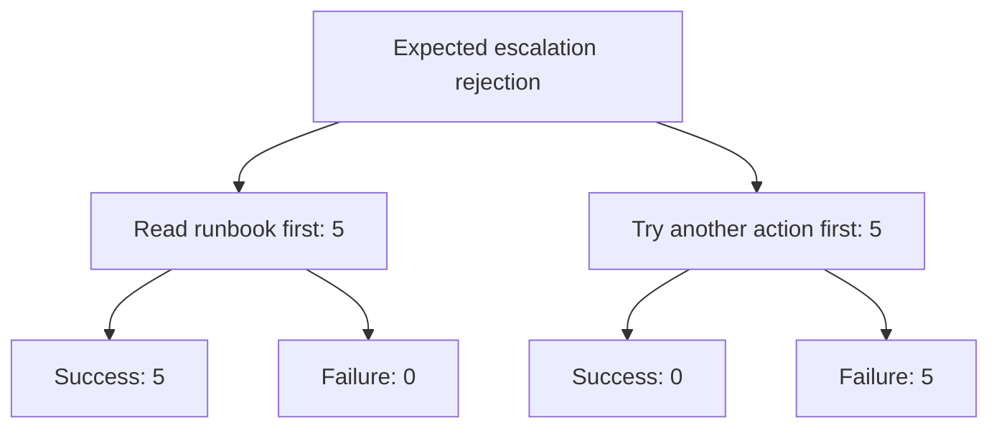

# Phase 5 Results: Stochastic Trace and Failure Paths

## What question are we answering?

The agent repeatedly receives the same synthetic Orders API incident. After its escalation is deliberately rejected, it must either read the runbook before trying another action or try another action first.

The practical question is:

> How often does each behaviour occur, and what failure percentage follows it?

This document is the single results record for Phase 5. Stage 5A is complete, and the frozen Stage 5B campaign now has all 100 valid observations.

## How the observations are represented

The first layer is scalar random variables measured once per fresh run: call count $N_r$, total latency $L_r$, tokens $T_r$, estimated cost $C_r$, and success $Y_r$. Their ordinary distributions are the basic results of the study. For example, $\widehat P(Y=1)$ is the observed success proportion across repeated runs.

The same run also produces a richer random object, its finite observable trajectory,

$$
\mathbf X_r=(X_{r1},\ldots,X_{rN_r}).
$$

The empirical distribution over complete paths is

$$
\widehat P(\mathbf X=x)=\frac{1}{R}\sum_{r=1}^{R}\mathbf 1\{\mathbf X_r=x\}.
$$

Thus path analysis does not replace scalar analysis: call count, latency, cost, and success are scalar summaries or functionals of each run, while the path preserves ordering information. We report the scalar results first and use paths to explain variation in those outcomes. The paths have random finite length; transition frequencies below are descriptive and do not assume a Markov model.

## Stage 5A: existing 90-run dataset

Stage 5A reanalysed the complete Phase 4 main campaign:

$$
N_{\mathrm{all}}=90,
\qquad
N_{\mathrm{Orders,recovery}}=10.
$$

No new model calls were made. The focused ten runs are pilot evidence and are not the Phase 5 main sample.

## Practical result

| First behaviour after expected escalation rejection | Success | Failure | Failure percentage |
|---|---:|---:|---:|
| Read runbook first | 5 | 0 | 0% |
| Tried another action first | 0 | 5 | 100% |

Let $H_r=1$ mean that the runbook was read before another action and let $F_r=1$ mean failure. The observed pilot estimates were

$$
\widehat P(F_r=1\mid H_r=1)=0,
$$

and

$$
\widehat P(F_r=1\mid H_r=0)=1.
$$

The estimated failure-risk difference, retry-first minus read-first, was

$$
\widehat\Delta=1.00.
$$

Its Newcombe 95% interval was

$$
[0.386,1.000].
$$

The Wilson intervals for the individual failure percentages were 0% to 43.4% for read-first and 56.6% to 100% for retry-first. Fisher's two-sided exact $p$-value was 0.00794.

The counts are striking, but each category contains only five runs. The wide intervals are the reason for collecting a separate 100-run main dataset.

## What did the traces look like?



The ten focused runs produced eight distinct complete tool-and-outcome paths. Seven paths occurred once. The most common path occurred three times. Plug-in path entropy was 2.846 bits, with a run-level bootstrap interval of 1.571 to 2.722 bits. The bootstrap interval is descriptive and can be biased downward with many previously unseen paths.

Among the five successful runs, excess calls relative to the five-call oracle had:

| Quantity | Calls |
|---|---:|
| Mean | 5.2 |
| Median | 5 |
| Interquartile range | 5 to 5 |
| Observed range | 5 to 6 |

No successful focused run exactly followed the five-call oracle. Extra investigation is not automatically useless, but it is additional MCP work.

## Variable definitions

| Variable | Type | Observed Stage 5A focused values |
|---|---|---|
| Runbook-first indicator $H_r$ | Binary | 0 or 1; five runs at each value |
| Failure indicator $F_r$ | Binary | 0 or 1; five runs at each value |
| Complete state path $X_r$ | Ordered categorical sequence | Eight observed paths |
| MCP-call count $N_r$ | Discrete count | Recorded per run |
| Successful-run excess $E_r$ | Discrete count or undefined | 5 to 6 among successes |
| Oracle distance | Continuous ratio in $[0,1]$ | Recorded per run |
| Batch | Categorical acquisition block | Phase 4 blocks 1 through 10 |

## Interpretation

Within this synthetic world, rereading the runbook changes the world state that gates the next escalation. The result therefore has a clear system mechanism. The agent's choice to reread was not randomized, however, so this is an observed behaviour-outcome association rather than a general causal effect for production agents.

The data show that complete traces contain information hidden by final-answer success alone. They do not reveal private model reasoning or establish that traces follow a Markov chain.

## Stage 5B: completed 100-run main campaign

The frozen main campaign collected 100 new Orders-recovery runs in ten batches of ten. The historical ten-run pilot and the separate three-run smoke campaign are not part of this sample.

The campaign completed with

$$
N_{\mathrm{valid}}=100
\quad\text{of}\quad
N_{\mathrm{planned}}=100.
$$

Seventeen provider-error attempts from the earlier quota interruption are retained for operational audit but excluded from every scientific count, percentage, path, transition, and interval. The final 100 valid runs have unique scheduled run IDs and pass measurement reconciliation.

### Final practical table

| First behaviour after expected escalation rejection | Success | Failure | Failure percentage |
|---|---:|---:|---:|
| Read runbook first | 71 | 0 | 0% |
| Tried another action first | 0 | 29 | 100% |

For the completed main sample,

$$
\widehat P(F_r=1\mid H_r=1)=0,
\qquad
\widehat P(F_r=1\mid H_r=0)=1,
$$

and the observed risk difference is

$$
\widehat\Delta=1.00.
$$

The Newcombe 95% interval for the risk difference is $[0.872,1.000]$. The Wilson 95% intervals for the individual failure percentages are 0% to 5.1% for runbook-first and 88.3% to 100% for retry-first. Fisher's two-sided exact $p$-value is approximately $1.26\times10^{-13}$.

These calculations describe the preplanned 100-run sample. The agent's branch choice was observed rather than randomized, so the result remains an association within this synthetic incident rather than a causal estimate.

### Final path and performance summaries

The 100 valid runs produced 22 distinct complete state paths. Thirteen paths occurred once. The modal path occurred 55 times, or 55.0% of valid runs. Plug-in path entropy was 2.700 bits, with a run-level bootstrap interval of 2.066 to 2.971 bits.

Among the 71 successful runs, the agent made a median of five calls beyond the five-call oracle; the observed excess ranged from four to six calls. No successful run exactly followed the oracle.

| Measured quantity per valid run | Median | Q1 to Q3 | Observed range |
|---|---:|---:|---:|
| MCP calls | 10 | 10 to 10 | 9 to 11 |
| Total agent runtime | 19.57 s | 18.72 to 21.20 s | 17.16 to 24.38 s |
| Model tokens | 10,444 | 10,337 to 10,521 | 8,961 to 12,185 |
| Exact MCP request-frame bytes | 1,835 | 1,835 to 1,854 | 1,675 to 2,222 |
| Exact MCP response-frame bytes | 35,949 | 35,942 to 35,987 | 32,663 to 39,319 |
| Estimated model cost | USD 0.03564 | USD 0.03518 to 0.03625 | USD 0.03271 to 0.04304 |

The frame-byte values are exact local stdio MCP/JSON-RPC bytes. They are not HTTP, TLS, TCP, or IP packet sizes.

The 100 valid observations account for an estimated USD 3.6000. Excluded provider-error attempts account for another estimated USD 0.01385 because two failed attempts had already made model calls before quota exhaustion. Total recorded attempted cost is therefore USD 3.6139.

### Acquisition audit

An earlier directory named `campaign-trace-orders-recovery-main-v1` contains nine runs collected before a configuration-fingerprint bug was found. The bug came from serializing unordered set-like scenario fields. That campaign was invalidated before analysis and is not used here. The corrected frozen fingerprint is stable across fresh Python processes, and the valid campaign is `campaign-trace-orders-recovery-main-v2`.

The initial collector continued after the first quota error and recorded 17 provider failures. The collector was changed and tested to stop after the first provider failure. On resume, preserved provider-error directories were moved to `excluded_attempts/` before their scheduled run IDs were retried. This changed campaign control without changing the scientific inclusion rule.

Stage 5B is complete: all 100 scheduled run IDs have valid measurements, artifact integrity checks pass, and this document reports the final analysis.

## Reproduce Stage 5A

```powershell
uv --cache-dir .uv-cache run --all-groups python -m agentic_ai_statistics.trace_study.campaigns reanalyze-phase4
```

Generated tables are written below `artifacts/phase5/campaign-phase4-main-reanalysis-v1/`. They remain ignored by Git because they contain generated run-level artifacts.

## Reproduce Stage 5B analysis

The completed campaign can be reanalysed without making a model call:

```powershell
uv --cache-dir .uv-cache run --all-groups python -m agentic_ai_statistics.trace_study.campaigns collect trace-orders-recovery-main-v2 --stage main --analyze-only
```

## Phase 6A: credit-free secondary analysis

Phase 6A made no model calls. It reused the 100 valid Stage 5B runs and asked where the observed differences appear in the trace, which tools dominate the work, and how the measured runtime is divided.

### Partial-history result

The two observable post-rejection histories account for all 100 runs:

| Observed history | Runs | Successes | Failures | Failure rate |
|---|---:|---:|---:|---:|
| Read runbook first | 71 | 71 | 0 | 0% |
| Retried first | 29 | 0 | 29 | 100% |

The two empty categories—no expected rejection and no follow-up action—had zero observations. These are empirical prefix summaries, not a fitted stochastic model.

### Tool usage

The most frequently invoked tools were `escalate_incident` (200 invocations), `get_runbook` (171), `restart_service` (102), `get_dependencies` (101), `get_alert` (100), `get_metrics` (100), and `search_logs` (100). `update_incident` appeared 9 times. Per-tool request bytes and latency are unavailable because the current recorder stores those quantities at run level.

### Runtime decomposition

The median measured runtime was approximately 19.57 seconds. Its median component shares were approximately:

| Component | Median time | Median share of total |
|---|---:|---:|
| Model | 18.32 s | 93.7% |
| MCP client time | 57.1 ms | 0.29% |
| Server handler time | 5.6 ms | 0.03% |
| Orchestration | 1.18 s | 6.0% |

These are measured local runtime components. They do not estimate queue waiting, network transmission, or Internet latency.

### Divergence and path concentration

The median first oracle divergence was step 2 for both successful and failed traces. The 100 valid traces had 22 distinct paths overall, with 13 singleton paths. The most common path covered 55% of runs and path entropy was 2.70 bits.

Phase 6A adds detail to the Phase 5 result but does not change its interpretation. The synthetic world still makes the runbook-first and retry-first branches strongly associated with outcome, and the observed branch was not randomized.

The complete small-question statistical learning sequence is recorded in [the Phase 6A statistical analysis roadmap](../planning/phase6_statistical_analysis_roadmap.md).
